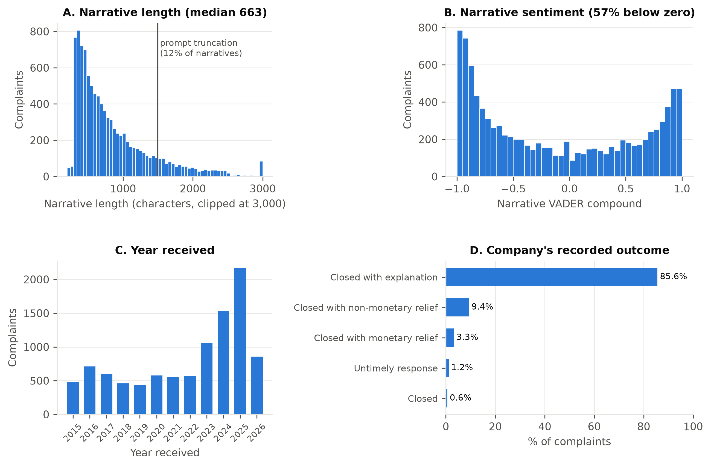
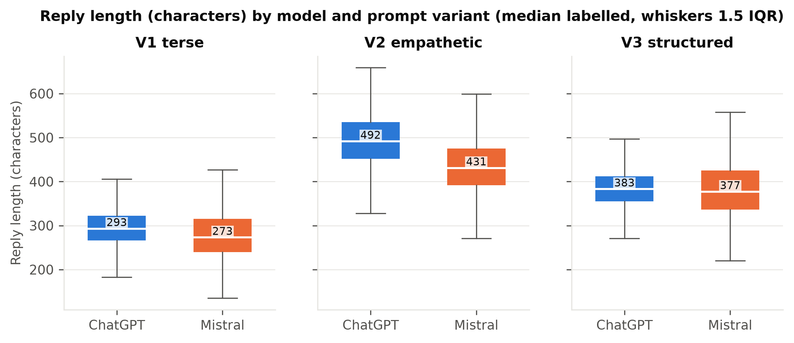
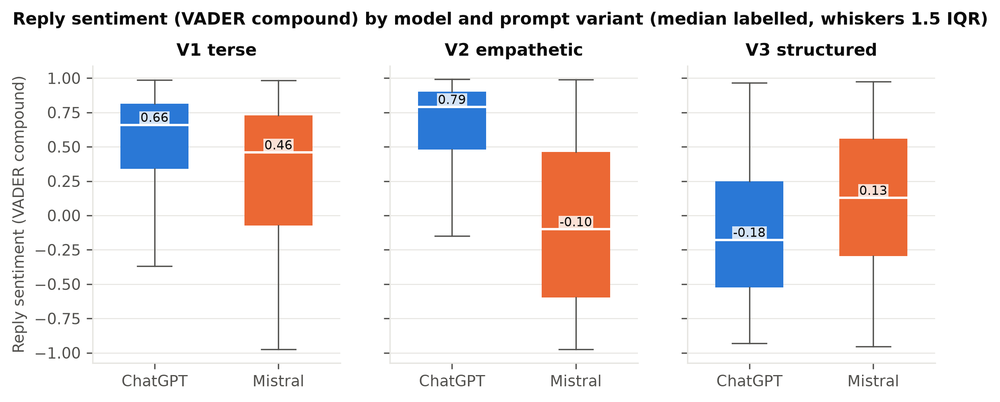
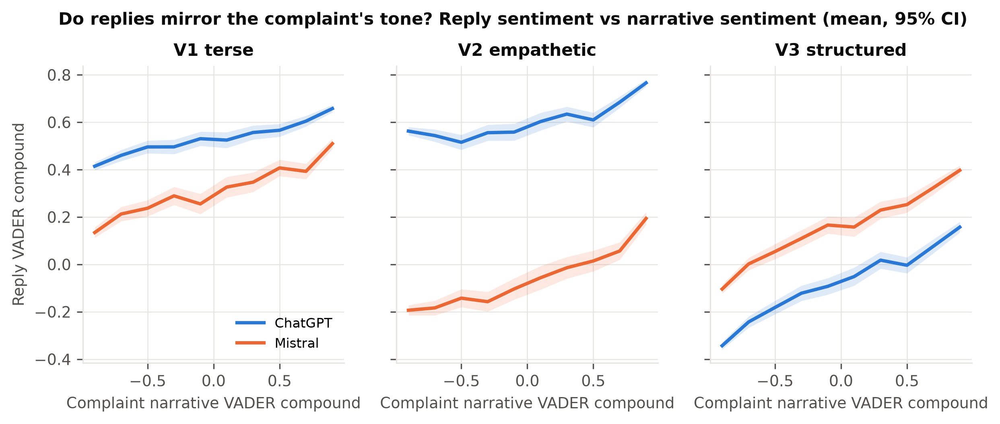
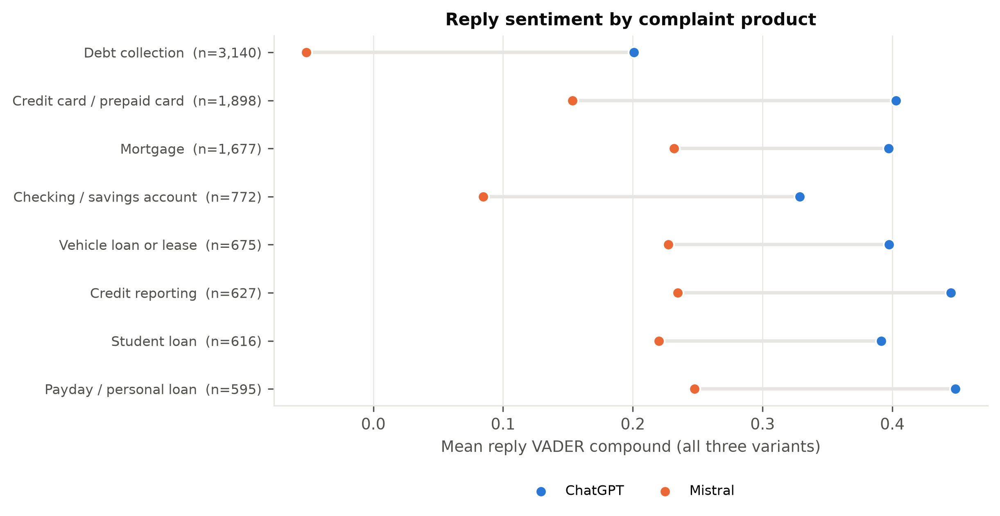
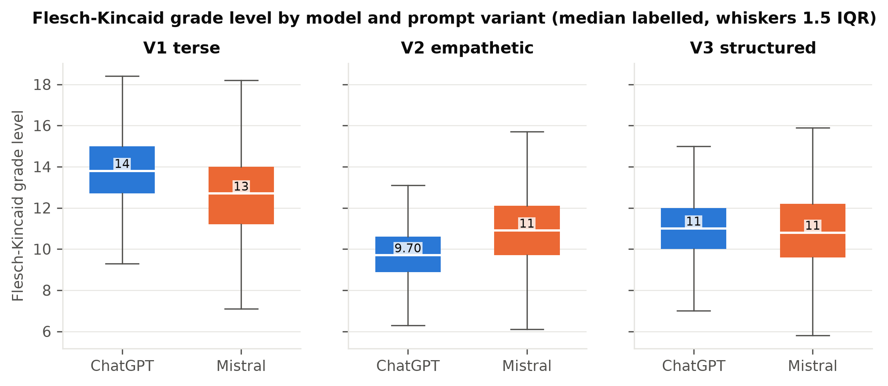
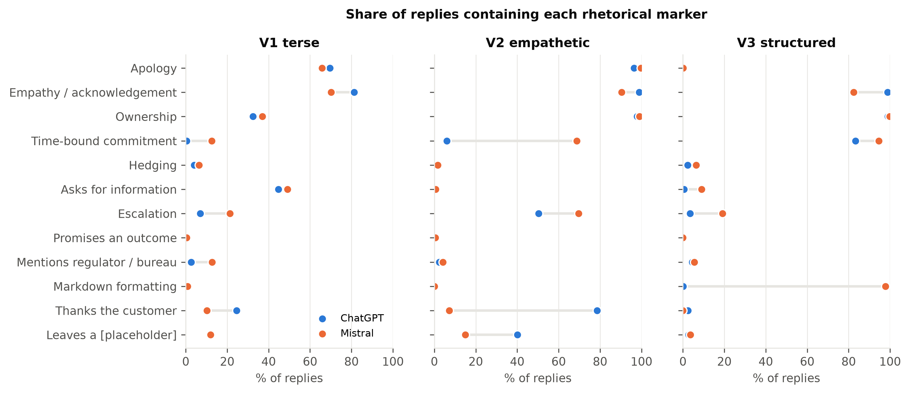
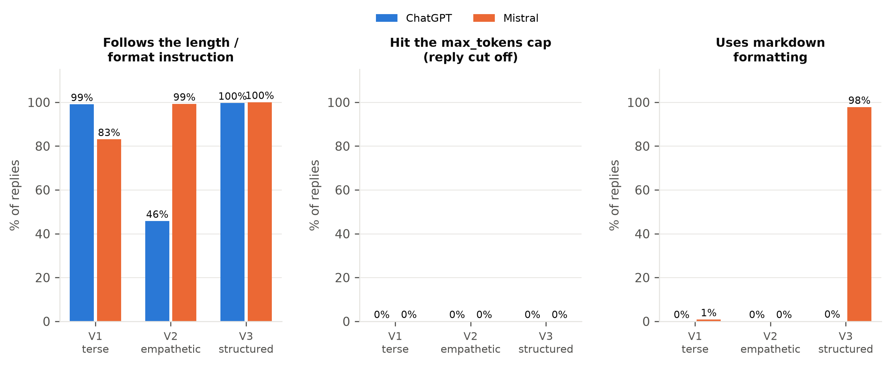
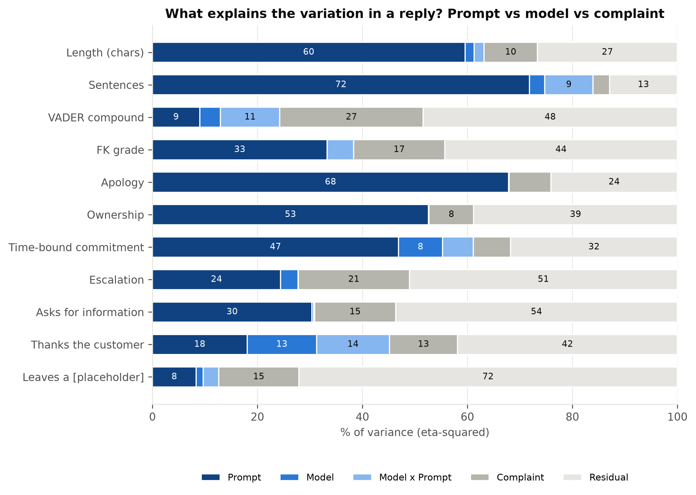
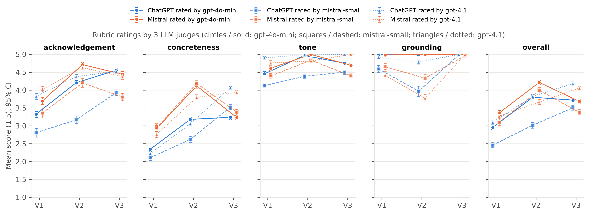

# Exploratory data analysis

*Candidate section for the paper, drafted separately so parts can be picked. Figures are embedded
from `analysis/figures/`; every number comes from `analysis/eda_sentiment.py`, `robustness.py`, or
the descriptive script run for this section.*

The EDA has two halves and walks through all ten figures. Section E.1 describes the complaints as
the models saw them (Figure 0), because the input distribution bounds what any reply can do. Section
E.2 describes the replies as distributions (Figures 1-10), before any hypothesis testing, so that the
effect sizes in the Results are read against the right baseline shapes.

## E.1 The complaints

**Figure 0. The 10,000 complaints.** A: narrative length, with the 1,500-character prompt truncation
marked. B: VADER compound of the narrative. C: year received. D: how the company resolved the
complaint, as recorded by the CFPB.

### Length: short, but with a long tail that the prompt cuts

Narratives are short. The median is 663 characters (118 words); a quarter are under 440 characters,
and 5% exceed 2,000. The 1,500-character truncation in the prompt affects 12% of complaints, which
matters for interpretation in two ways. First, for those complaints the models replied to a
narrative cut at a word boundary with a trailing "[...]", so some acknowledgement inaccuracies in
the judge ratings may be truncation, not model error. Second, narrative length is the complaint
feature with the strongest downstream footprint: reply length correlates with it in every condition
(Spearman 0.08 to 0.42, Table E1), so longer complaints get longer replies even when the prompt fixed
the sentence count. The V2 ChatGPT correlation (0.42) is the largest and coincides with ChatGPT's
weakest length compliance, which suggests that ChatGPT's over-length V2 replies are partly a response
to longer inputs rather than a constant house style.

Mortgage complaints are the longest (median 846 characters) and credit-reporting complaints the
shortest (544), consistent with the former describing multi-step servicing histories and the latter
disputing a single tradeline.

### Sentiment: the narratives are not uniformly negative, and that is a property of the instrument

One might expect complaint narratives to score strongly negative. They do not. The VADER compound
distribution (Figure 0B) is bimodal with modes near -0.9 and +0.9; the median is -0.27, the
interquartile range runs from -0.81 to +0.59, and only 57% score below zero. This is a known property
of lexicon scoring on long, mixed-register text: a narrative that says "I was very happy with the
bank until they closed my account without any notice, which is unacceptable" carries positive tokens
that a lexicon counts at face value, and the compound score saturates toward ±1 as text length grows,
which produces the U-shape. Two consequences follow for the rest of the paper.

- The "narrative sentiment quintiles" used in Section 5.6 partition complaints by lexical
  vocabulary, not by grievance severity. The top quintile is not "mild complaints"; it is complaints
  whose authors used more positive words.
- Product families differ sharply on this measure: 73% of debt-collection narratives score below
  zero (mean -0.37), against 47-53% for every other family (means -0.15 to +0.05). Debt-collection
  narratives describe harassment, threats, and legal action, and the lexicon registers that. This is
  the mechanism behind the product effect on reply sentiment in Section 5.6: the models, especially
  Mistral, carry the complaint's vocabulary into the reply.

### Redaction: mostly absent

The CFPB replaces names, dates, and amounts with `XXXX` and `{$…}` tokens. Two thirds of the selected
narratives contain no redaction at all, and only 5% have more than 5% of their characters redacted,
because the selection step capped redaction at 25% and ranked low-redaction narratives higher. In
the OLS (Section 5.6) the redaction ratio has no detectable effect on reply sentiment. Redaction does
leak into replies in a small way: 0.4-1.3% of replies echo an `XXXX` token, usually as "Dear XXXX
XXXX" when a model copies the redacted name into a salutation.

### Time and outcome: a recent, "closed with explanation" corpus

Half of the complaints were received in 2024-2026 (Figure 0C), because the CFPB's volume has grown
and the selection favoured detailed narratives, which are more common in recent submissions. All were
submitted via the web. The company's recorded outcome is "closed with explanation" for 86% of
complaints, non-monetary relief for 9%, monetary relief for 3%, and an untimely response for 1%
(Figure 0D); 96% received a timely response. The outcome field is therefore heavily skewed, and any
analysis conditioning on relief has small groups (330 monetary-relief complaints). We use it only
for the null result in Section 5.6: the models never see it, and the replies do not reflect it.

### Category structure

The category-capped selection spreads the 10,000 complaints over 60 issues, 266 sub-issues, and
1,957 (product, sub-product, issue, sub-issue) combinations. The most frequent issues are "Incorrect
information on your report" (949), "Problem with a company's investigation into an existing problem"
(494), and "Took or threatened to take negative or legal action" (487). Debt collection still holds
31% of the set because it has the most distinct sub-issues, not because it was over-sampled within
category. Servicemembers are tagged on 13% of complaints and older Americans on 6%; we do not analyse
these tags, but they are available for follow-up work.

**Table E1. Reply length vs narrative length, Spearman ρ, by condition.**

| | ChatGPT | Mistral |
| --- | ---: | ---: |
| V1 terse | 0.28 | 0.32 |
| V2 empathetic | 0.42 | 0.23 |
| V3 structured | 0.18 | 0.08 |

## E.2 The replies

### Length: the prompt sets the centre, the model sets the spread

**Figure 1. Reply length in characters by prompt and model.** Boxes are interquartile ranges,
whiskers 1.5 IQR, medians labelled.

Three things are visible in Figure 1 before any test is run. The prompt sets the centre of each
distribution: medians move from about 280-290 characters (V1) to 430-490 (V2) and 380 (V3) for both
models, and the three prompts' boxes barely overlap. Within a prompt the models' medians differ by
at most 60 characters, and under V3 by 6. But the models differ in spread: Mistral's interquartile
range is wider in every prompt (standard deviations 62-64 characters against ChatGPT's 42-61), and
under V1 its whiskers reach both lower and higher than ChatGPT's. ChatGPT is the more uniform writer;
Mistral varies its length more with the complaint, which is consistent with its higher reply-narrative
length correlation under V1 (0.32 vs 0.28) but not under V2 (0.23 vs 0.42), where ChatGPT's length
tracks the input instead.

The sentence-count distributions are almost degenerate: under V1 99% of ChatGPT replies and 83% of
Mistral replies have exactly two sentences; under V3 99% of both have exactly three (one per label).
Only V2 shows a real distribution, and it differs by model: ChatGPT writes 4 sentences in 46% of
replies, 5 in 45%, and 6 in 9%; Mistral writes 3 in 50% and 4 in 49%. So "3-4 sentences" was read by
Mistral as a range to stay inside and by ChatGPT as a floor.

### Sentiment: three different distribution shapes

**Figure 2. Reply VADER compound by prompt and model.**

The sentiment boxes do not merely shift between conditions; they change shape.

- **V1** is right-skewed and positive for both models. ChatGPT's median is 0.66 with 12% of replies
  below zero; Mistral's median is 0.46 with 27% below zero and a lower whisker reaching -0.95. The
  bare instruction produces short apologies ("We sincerely apologize…"), which VADER scores as
  positive; Mistral's longer tail comes from replies that restate the problem first.
- **V2** splits the models. ChatGPT's distribution is compressed at the top (median 0.79, 90th
  percentile 0.94, 11% below zero): almost every reply thanks and reassures. Mistral's distribution is
  wide and centred near zero (median -0.10, interquartile range -0.60 to +0.46, 54% below zero). This
  is the largest model effect in the corpus (paired *d* = 1.06). Mistral's V2 replies are not
  uniformly negative; they are bimodal, and which mode a reply falls into depends on whether it leads
  with the grievance or with the apology.
- **V3** inverts the models. ChatGPT's structured replies are now the more negative (median -0.18,
  56% below zero) and Mistral's are near neutral (median 0.13, 36% below zero). The `Acknowledgement:`
  line restates the complaint in both cases; ChatGPT's restatements are longer and fuller ("We
  understand that you are concerned about being sued … without proper notification and that you
  believe a judgment against you was obtained illegally") and so carry more of the complaint's
  negative vocabulary, while Mistral's are terser and its bolded labels dilute the lexicon.

The VADER positive and negative token shares make the mechanism explicit. Under V3 both models' positive
share collapses (0.05-0.07, from 0.18-0.21 under V1) because the format removes apologies and thanks,
while the negative share also falls (0.05-0.06). What is left is a near-neutral restatement whose sign
is decided by a few words. Under V2, by contrast, ChatGPT keeps a high positive share (0.18) while
Mistral's positive share drops to 0.11 and its negative share rises to 0.12: Mistral adds grievance
vocabulary and removes gratitude.

### Mirroring: replies track the complaint's tone, at different slopes

**Figure 4. Reply sentiment as a function of narrative sentiment.** Narratives binned into ten
equal-width VADER intervals; lines are cell means, bands 95% confidence intervals.

Every line in Figure 4 slopes upward: in all six conditions, complaints with more positive lexicon
scores get more positive replies (Spearman ρ 0.18 to 0.39). But the slopes and the gaps differ, and
the difference is the interesting part.

- Under **V1**, the two lines are nearly parallel and about 0.2 apart; both models mirror the input
  to the same degree and ChatGPT sits uniformly higher. This is the baseline mirroring the task
  itself induces: a two-sentence reply must name the problem, and naming the problem imports its
  vocabulary.
- Under **V2**, the ChatGPT line is high and almost flat (0.5 at the most negative narratives, 0.7 at
  the most positive), while the Mistral line starts at -0.2 and climbs to +0.2. ChatGPT's persona
  overrides the input: whatever the complaint said, the reply thanks and reassures. Mistral's persona
  amplifies it: the angrier the complaint, the more grievance vocabulary the reply carries. The gap
  between the models is therefore widest for the angriest complaints, which are the ones a
  complaint-handling system most needs to get right.
- Under **V3**, both lines are steep (ρ 0.39 and 0.38, the strongest mirroring in the corpus) and the
  ordering flips, with ChatGPT lower. The `Acknowledgement:` field is a restatement by construction,
  so the reply's lexicon is largely the complaint's lexicon, and ChatGPT's fuller restatements carry
  more of it.

The practical reading is that mirroring is not a fixed model property. The same model is nearly
immune to the input under one prompt and highly sensitive under another, and the prompt that asks
for a structured acknowledgement is the one that makes replies track the complaint most closely.

### Product: the debt-collection gap

**Figure 5. Mean reply sentiment by complaint product family, pooled over the three prompts.**

Across the eight product families, ChatGPT's mean reply sentiment sits in a narrow band (0.20 to
0.45) and Mistral's in a wider one (-0.04 to 0.25), and Mistral is lower in every family. The
ordering of families is nearly the same for both models: payday and personal loans, credit
reporting, and credit cards draw the most positive replies; checking and savings accounts and debt
collection the least. The debt-collection row stands out twice over. It is the largest family
(3,140 complaints), and it has the widest gap: ChatGPT 0.20, Mistral -0.04, the only cell below
zero.

Section E.1 gives the mechanism. Debt-collection narratives are the most negative in the corpus by
lexicon (73% below zero, mean -0.37), because they describe harassment, threats, and legal action.
A model that restates the complaint imports that vocabulary; a model that reassures does not. The
OLS in Section 5.6 confirms the effect survives controls for narrative sentiment and length, so it is
not only that debt-collection narratives are angrier; the models also respond to the topic itself.
For a deployer, this means a single global sentiment target for replies will be missed
systematically in one product line, and any evaluation set that under-represents debt collection
will overstate average reply warmth.

### Readability: the prompt lowers the grade level more than the model does

**Figure 8. Flesch-Kincaid grade level by prompt and model.**

Unconstrained (V1), both models write at a college reading level: median grade 13.8 for ChatGPT and
12.7 for Mistral, with 90th percentiles of 16.0 and 15.4. Two-sentence replies to a complaint tend to
be two long, clause-heavy sentences. The V2 instruction to "write in plain language" is the only
prompt that mentions readability, and it works: ChatGPT drops to a median of 9.7 (interquartile range
8.9-10.6) and Mistral to 10.9. ChatGPT's reduction is larger partly because it writes more, shorter
sentences (grade level falls with sentence length), so the same non-compliance that breaks the
length instruction helps the readability one. V3 lands both models near grade 11 without asking for
plain language; the three-field format shortens sentences by construction. No condition reaches the
grade 8-9 level usually recommended for consumer communications, and the V1 baseline is two to three
grades above it.

### Rhetorical markers: what the prompts switch on and off

**Figure 3. Share of replies containing each rhetorical marker.**

Read column by column, Figure 3 shows the prompts acting as switches. Apology is on under V1 and V2
(66-100%) and off under V3 (0%). Ownership is partial under V1 (32-37%) and near-universal under V2
and V3 (98-100%). Requests for information are frequent under V1 (45-49%), where the two-sentence
budget leaves no room for a commitment so the models ask for details instead, and rare under V2 and
V3, which each demand a next step. Time-bound commitments are rare under V1 and V2 for ChatGPT (0.4%,
6%) but common for Mistral under V2 (69%) and for both under V3 (83-95%), where the label asks "by
when". Thanking the customer is the one marker that is mostly a model trait: ChatGPT thanks under V1
(25%) and V2 (79%), Mistral rarely does (10%, 7%), and V3 suppresses it for both.

Read row by row, the markers where the two dots sit far apart in a panel are the model differences
worth explaining: ownership phrasing under V1 (Mistral higher), time-bound commitments and
escalation under V2 (Mistral higher), thanks and placeholders under V2 (ChatGPT higher), and markdown
under V3 (Mistral 98%, ChatGPT 0%). Everywhere else the dots nearly coincide, which is the visual form
of the variance-decomposition result: the prompt column matters, the model row mostly does not.

Two markers are near zero everywhere and are informative for that reason. Promised outcomes
(≤ 0.4%) and hedging (2-6%) show that neither model volunteers refunds or caveats when replying to a
complaint, with or without the V3 constraint against promises. The judges' broader reading of
"promise" (Section 5.7) finds more, which is a difference in definition, not in the replies.

### Instruction compliance

**Figure 6. Instruction following: length/format compliance, token-cap truncation, markdown.**

The middle panel is a control: no reply in any cell hit its token cap, so nothing that follows is a
truncation artefact. The left panel shows compliance is high everywhere except ChatGPT under V2
(46%), and the right panel shows markdown is absent everywhere except Mistral under V3 (98%). Both
exceptions are model-specific responses to a particular prompt rather than general traits, which is
why they show up as model × prompt interaction rather than model main effect in Table 2.

### Cost and latency

The corpus cost little to produce and the models are operationally similar. Prompt tokens per reply
average 200-325 (the complaint text dominates), completion tokens 49-95, and median latency 0.8-1.1
seconds, with ChatGPT roughly 0.05-0.1 seconds slower per call at every prompt. V2 is the most
expensive prompt for both models (95 and 88 completion tokens) because it produces the longest
replies; V3's fixed format is 15-23% cheaper than V2 and only marginally slower than V1. Totals over
the 30,000 replies per model were 7.9M prompt and 2.2M completion tokens for ChatGPT and 8.5M and
2.2M for Mistral.

### Where the variation comes from

**Figure 9. Share of each feature's variance explained by prompt, model, their interaction, the
complaint, and residual.** Balanced design, so the components are orthogonal and sum to 100%.

Figure 9 summarises the previous six figures in one picture. Read the dark-blue segment first: it
is the prompt's share, and it is the largest component for every feature except VADER sentiment and
placeholders. It exceeds half of the variance for sentence count (72%), apology (68%), length (60%),
and ownership (53%). Then look for the mid-blue segment, the model's main effect: it is visible only
for thanking (13%), time-bound commitments (8%), and sentiment (4%), and is a sliver or absent
elsewhere. The light-blue interaction segment is as large as or larger than the model segment for
sentiment (11%), sentence count (9%), and thanking (14%), which says the models differ mostly in how
they react to a specific prompt rather than in a stable style.

The grey segment, the complaint, is largest for sentiment (27%) and escalation (21%): which complaint
is being answered matters for how the reply sounds and whether it escalates, but not much for how
long it is or whether it apologises. The residual is largest for placeholders (72%) and requests for
information (54%), i.e. these behaviours are close to random at the level of an individual reply,
which is what one would expect of a sampling-temperature artefact rather than a systematic choice.
Placeholders are the clearest case: 8% prompt, 1% model, 15% complaint, 72% noise. That is also why
they are cheap to fix. A behaviour that is mostly noise is not being driven by anything the prompt
says, so a single explicit instruction against it has nothing to fight.

### How the replies are judged

**Figure 10. Mean rubric scores (1-5) from two blind LLM judges by prompt and model.** Circles and
solid lines: gpt-4o-mini as judge. Squares and dashed lines: mistral-small as judge. Bars are 95%
confidence intervals over 299 complaints per cell.

Figure 10 is the only figure in which the y-axis is a quality judgement rather than a measured
property, so it should be read alongside the others rather than on its own. Five patterns are
visible.

- **Both prompts beat the baseline.** Every line rises from V1 to V2 on acknowledgement,
  concreteness, tone, and overall, for both models and both judges. The bare instruction produces the
  worst replies by every criterion except grounding.
- **V2 is where the models separate, and Mistral wins it.** On concreteness the orange V2 points
  (Mistral) sit a full point above the blue ones (ChatGPT) under both judges; on overall they sit
  0.4-1.0 higher. This is the same cell where lexicon sentiment ranked ChatGPT far ahead (Figure 2).
  The two instruments disagree because they measure different things: VADER counts gratitude words,
  the rubric counts a named action with an owner and a date.
- **V3 collapses the model gap.** At V3 the blue and orange points coincide within 0.15 on every
  criterion under both judges, the judged counterpart of the near-zero *d* values in Table 3. The
  format, not the model, determines the reply.
- **Grounding is the one criterion the judges cannot agree on.** The GPT judge (solid) scores it at
  the ceiling everywhere; the Mistral judge (dashed) dips at V2, most for ChatGPT (3.97), penalising
  unsupported specifics such as "I'll escalate this to our compliance team today". The inter-judge
  correlation on this criterion is 0.06. Grounding as judged by an LLM is therefore not a stable
  measure here, and the regex audit in Section 5.4, which finds under 1% hard fabrication, is the more
  reliable instrument for invented facts.
- **The dashed lines sit below the solid ones,** for both models, on every criterion. The Mistral
  judge is harsher in general, by about 0.4 points. And the dashed lines are lower for ChatGPT by
  more than they are for Mistral, which is the self-preference shift quantified in Table 8: each
  judge favours its own family by about a quarter of a standard deviation, without changing which
  model it ranks first.

The overall picture is that the judges, the lexicon, and the regex markers agree on where the
action is (V2, and the ChatGPT-Mistral split within it) and disagree on which side of it is better.
That disagreement is the paper's evaluation finding, and it is visible in the raw distributions
before any test is applied.

### How reply features relate to each other

Within a single cell (ChatGPT, V2), reply length correlates with sentence count (Spearman 0.54), with
sentiment (0.44), and with narrative length (0.42); sentence count correlates negatively with grade
level (-0.42) because more sentences means shorter ones; and reply sentiment correlates with
narrative sentiment (0.18) and narrative length (0.25) but not with redaction (0.11). The
length-sentiment correlation is worth noting for the judge analysis: longer ChatGPT V2 replies are
both more positive by VADER and, per Section 5.7, rated higher by the GPT judge, so length is a
confound in both directions.

## E.3 What the EDA settles before the tests

1. The input is short, recent, lightly redacted, and heavily "closed with explanation"; there is
   no outcome signal for the models to pick up, and 12% of narratives were truncated.
2. Narrative VADER scores are bimodal and lexical, not a severity scale; product effects on reply
   sentiment run through vocabulary, above all in debt collection.
3. Reply length and sentence count are almost fully determined by the prompt; the V2 ChatGPT cell
   is the only one with a real length distribution, and it is over-length.
4. Reply sentiment distributions change shape across prompts, not just location, and the model
   ordering flips between V2 and V3. Any single "which model is more positive" statement is
   prompt-specific.
5. Readability is moved by the one prompt that asks for it, and by sentence length as a side
   effect; no condition reaches consumer-communication targets.
6. The rhetorical markers behave as prompt-controlled switches with a handful of model-specific
   exceptions (thanks, markdown, V2 deadlines), which is the qualitative form of the variance
   decomposition in Section 5.1.
7. Mirroring of the complaint's tone is prompt-dependent: ChatGPT under V2 is nearly immune to the
   input, Mistral under V2 amplifies it, and V3 makes both track it closely.
8. Debt collection is the product where the models diverge most, because its narratives carry the
   most negative vocabulary and one model restates while the other reassures.
9. The variance decomposition confirms the picture feature by feature: prompt first, complaint
   second, model a distant third, and placeholders mostly noise.
10. Two LLM judges agree with the lexicon on where the models differ (V2) and disagree with it on
    which is better; grounding is the one criterion on which the judges do not agree with each other.
