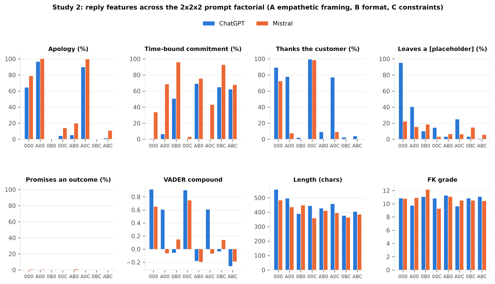

# Prompt beats model, and wording moves both: how instruction framing shapes LLM replies to real consumer-finance complaints

*Draft manuscript. Figures are in `analysis/figures/`, tables in `analysis/tables/`; every number is
reproducible from the scripts in `analysis/`. Citations are marked `[cite]` where the author should
insert references; none have been invented.*

## Abstract

Financial institutions are beginning to use large language models (LLMs) to draft first responses to
customer complaints, a regulated communication where tone, concreteness, and factual restraint all
matter. We ask how much of such a draft is determined by the model, how much by the instruction, and
how much by the complaint itself. We take 10,000 complaints with consumer narratives from the U.S.
Consumer Financial Protection Bureau (CFPB) public database, selected for coverage across product,
issue, and sub-issue categories, and generate replies with two small commercial models (OpenAI
`gpt-4o-mini` and Mistral `mistral-small-latest`). Three realistic prompts, a bare two-sentence
instruction, an empathetic customer-service persona, and a rigid three-field format with compliance
constraints, are run over the full corpus in a balanced crossed design (60,000 replies). On a
stratified 2,999-complaint subset we then take the empathetic prompt apart in a 2×2×2 factorial over
empathetic framing, structured format, and compliance constraints, and add a one-line output-hygiene
mitigation and two content-preserving paraphrases (59,980 further replies). Replies are measured for
length, lexicon and transformer sentiment, readability, twelve rhetorical markers, instruction
compliance, unfilled template placeholders, and invented facts, and rated on a rubric by two blind LLM
judges.

Four results stand out. First, the prompt explains far more of the variation in a reply than the
model does: 60-72% of the variance in length and sentence count and 47-68% of the variance in
apologising, taking ownership, and committing to a deadline is attributable to the prompt, against
0-13% for the model, and under a rigid format the two models become nearly indistinguishable. Second,
the factorial shows which part of the prompt does what: the structured format and the compliance
constraints each remove apologies on their own, empathetic framing restores them against the
constraints but not against the format, and constraints without positive instructions turn replies
into hedged boilerplate. Third, the same "empathetic" instruction is read in opposite registers:
ChatGPT becomes uniformly warm while Mistral restates the grievance in the customer's own words and
commits to a dated action, and two blind judges prefer Mistral's replies on concreteness while
flagging them for admitting liability. Fourth, the dominant deployment failure is not fabrication,
which occurs in under 1% of replies, but the unfilled template placeholder, present in 95% of
ChatGPT's replies to the bare instruction and 40% under the empathetic prompt; a one-line hygiene
instruction removes it entirely at some cost in warmth. Content-preserving paraphrases of a prompt
move reply features by 0.4-1.2 standard deviations, as much as switching models does, so a share of
what is usually attributed to "the prompt" is phrasing rather than content. We discuss implications
for prompt design and evaluation in regulated customer communication.

## 1. Introduction

Complaint handling is a high-volume, high-stakes text task. In the United States, the CFPB has
published millions of consumer complaints since 2011, a substantial share with a free-text narrative
written by the consumer, and requires companies to respond within a fixed period [cite]. Institutions
are experimenting with LLMs to draft these responses [cite], and vendors market "empathetic" and
"compliant" reply generation. Yet the design choices a deployer actually controls, which model to
call, what the instruction asks for, and how it is phrased, are rarely compared on the same inputs at
scale.

This paper asks a simple question: when an LLM drafts a reply to a real complaint, how much of what
comes back is determined by the model, how much by the prompt, and how much by the complaint? We
answer it in two layers on one corpus. At full scale, three realistic prompts are crossed with two
models over 10,000 complaints. On a stratified subset, the empathetic prompt is decomposed into its
components in a factorial design, so that the full-scale effects can be attributed to framing,
format, or constraints rather than to the bundle, and the sensitivity of the results to mere
rewording is measured directly. Throughout, replies are measured along dimensions that matter to a
compliance reviewer rather than only to a benchmark.

Our contributions are:

1. A public, reproducible corpus of about 120,000 LLM replies to 10,000 CFPB complaints, with the
   prompts, the selection procedure, and per-reply features, extendable to further models.
2. A variance decomposition showing that prompt wording dominates model choice for nearly every
   stylistic and content feature we measure (Section 5.2).
3. A factorial attribution of the prompt effect to its components, which shows that apologies are
   removed by format and by constraints independently, that constraints alone backfire, and that
   the models converge under a fixed format (Section 5.3).
4. Evidence that "empathetic" is not a model-independent instruction: the same framing makes one
   model warmer and the other more concrete and more negative in tone, and rubric judges prefer the
   latter (Sections 5.4 and 5.9).
5. A characterisation of failure modes at scale, in which unfilled placeholders, silent length
   non-compliance, and unrequested markdown are far more common than invented facts, together with
   a measured mitigation (Sections 5.5 and 5.6).
6. A measurement of paraphrase sensitivity showing that surface wording moves replies as much as
   model choice does (Section 5.7), and a comparison of lexicon sentiment, transformer sentiment,
   and LLM-judge rubric ratings as evaluation instruments (Section 5.9).

## 2. Related work

*To be expanded by the author.* Relevant strands: LLMs for customer service and complaint response
[cite]; prompt sensitivity and instruction following in LLMs [cite]; empathy in dialogue systems and
its measurement [cite]; sentiment analysis of consumer complaints, including prior work on the CFPB
database [cite]; LLM-as-a-judge evaluation and its biases, including self-preference and verbosity
bias [cite]; and hallucination taxonomies distinguishing fabricated specifics from unsupported
claims [cite].

## 3. Data

### 3.1 Source and selection

We use the CFPB Consumer Complaint Database public export (`complaints.csv`, downloaded September
2026). From it we keep complaints that (i) have both an `Issue` and a `Sub-issue`, with the sub-issue
not a copy of the issue; (ii) have a consumer narrative of at least 200 characters; (iii) have at
most 25% of narrative characters inside the CFPB's `XXXX` redaction tokens; and (iv) are not exact
narrative duplicates. From the resulting pool we select 10,000 complaints by category-capped
sampling: every (`Product`, `Sub-product`, `Issue`, `Sub-issue`) combination receives up to *C* rows,
where *C* is the smallest cap that reaches 10,000, and within a combination the rows with the highest
quality score are taken. The quality score rewards narrative length in the 300-2,500 character range,
detailed category labels, and low redaction. The selection therefore over-represents rare categories
relative to the raw database and prevents the dominant credit-reporting categories from crowding out
others; it is not a random sample of complaints and should not be read as one.

The selected set spans eight product families (Table 1), 60 distinct issues, 266 distinct sub-issues,
and 1,957 distinct (`Product`, `Sub-product`, `Issue`, `Sub-issue`) combinations. The most frequent
issues are "Incorrect information on your report" (949), "Problem with a company's investigation into
an existing problem" (494), and "Took or threatened to take negative or legal action" (487). Debt
collection holds 31% of the set because it has the most distinct sub-issues, not because it was
over-sampled within category.

**Table 1. Composition of the 10,000-complaint set.**

| Product family | Complaints |
| --- | ---: |
| Debt collection | 3,140 |
| Credit card / prepaid card | 1,898 |
| Mortgage | 1,677 |
| Checking / savings account | 772 |
| Vehicle loan or lease | 675 |
| Credit reporting | 627 |
| Student loan | 616 |
| Payday / personal loan | 595 |

For the factorial, hygiene, and paraphrase prompts we use a 2,999-complaint subset, stratified by
product family in proportion to Table 1 with a fixed seed. The 300-complaint judge sample (Section
4.5) is drawn by the same procedure and is, by construction, a prefix of the subset; 299 of its 300
complaints are in it.

### 3.2 What the models see

Each complaint is rendered as three lines: `Issue:`, `Sub-issue:` (omitted when blank or identical to
the issue), and `Complaint:` followed by the narrative, truncated at a word boundary to 1,500
characters. The company name, the CFPB's recorded outcome, dates, and all other metadata are withheld.
Because the CFPB redacts every dollar amount as `{$1,234.00}`, every date as `XX/XX/XXXX`, and every
name as `XXXX`, the input contains no calendar dates, no names, and no company identity unless the
consumer wrote it into the narrative. This property makes fabrication detectable (Section 4.4).

### 3.3 Corpus characteristics

**Figure 0. The 10,000 complaints.** A: narrative length, with the 1,500-character prompt truncation
marked. B: VADER compound of the narrative. C: year received. D: how the company resolved the
complaint, as recorded by the CFPB.

**Length.** Narratives are short: median 663 characters (118 words), a quarter under 440, 5% over
2,000. The prompt truncation affects 12% of complaints, so for those the models replied to a narrative
cut at a word boundary, and some acknowledgement inaccuracies in the judge ratings may be truncation
rather than model error. Narrative length is the complaint feature with the strongest downstream
footprint: reply length correlates with it in every condition (Spearman ρ 0.08-0.42), so longer
complaints get longer replies even when the prompt fixed the sentence count. Mortgage complaints are
the longest (median 846 characters) and credit-reporting complaints the shortest (544).

**Sentiment.** Complaint narratives do not score uniformly negative on a lexicon. The VADER compound
distribution (Figure 0B) is bimodal with modes near -0.9 and +0.9, a median of -0.27, an interquartile
range from -0.81 to +0.59, and only 57% below zero. This is a property of lexicon scoring on long,
mixed-register text: a narrative that says "I was very happy with the bank until they closed my
account without any notice" carries positive tokens that a lexicon counts at face value, and the
compound score saturates toward ±1 as text length grows. Two consequences follow. The narrative
sentiment quintiles used in Section 5.8 partition complaints by vocabulary, not by grievance
severity. And product families differ sharply on this measure: 73% of debt-collection narratives
score below zero (mean -0.37) against 47-53% for every other family (means -0.15 to +0.05), because
debt-collection narratives describe harassment, threats, and legal action. This is the mechanism
behind the product effect on reply sentiment in Section 5.8.

**Redaction, time, outcome.** Two thirds of the narratives contain no redaction; only 5% have more
than 5% of characters redacted. Half of the complaints were received in 2024-2026, all via the web.
The company's recorded outcome is "closed with explanation" for 86%, non-monetary relief for 9%,
monetary relief for 3%, and an untimely response for 1%; 96% received a timely response. The outcome
field is therefore heavily skewed, and we use it only for a null result (Section 5.8): the models
never see it, and the replies do not reflect it.

## 4. Method

### 4.1 Prompts

All prompts wrap the same rendered complaint and differ only in the instruction (full text in
Appendix A). They form two layers of one design.

**Realistic prompts, full corpus.** Three prompts written the way a practitioner would write them,
run over all 10,000 complaints:

- **V1 terse.** "Respond to the following consumer complaint in 2 sentences." No persona, no tone
  guidance. `max_tokens` = 150.
- **V2 empathetic.** A persona ("an experienced customer service representative at a financial
  institution, known for being warm and genuinely helpful"), an instruction to reply in 3-4
  sentences, acknowledge the frustration, take ownership on behalf of the institution, describe one
  concrete next step, use plain language, and not ask the customer to repeat information.
  `max_tokens` = 300.
- **V3 structured.** A persona "operating under CFPB complaint-handling rules", a fixed three-field
  format (`Acknowledgement:` / `Next step:` / `What we need from you:`), and explicit constraints: do
  not promise a specific outcome, do not admit legal liability, do not give legal or tax advice, do
  not invent account numbers, dates, or dollar amounts. `max_tokens` = 350.

**Factorial decomposition, 2,999-complaint subset.** V2 and V3 each change several things at once,
so the full-corpus comparison cannot say which component of a prompt produces which effect. We
therefore cross three binary factors, all with the same three-to-four-sentence target so that
length is not confounded:

- **A, empathetic framing**: V2's persona and directives.
- **B, structured format**: the three labelled fields.
- **C, compliance constraints**: V3's four prohibitions.

The all-off cell is "Reply to the following consumer complaint in 3-4 sentences."; the A-only cell is
V2 itself, reused from the full corpus. Cells are labelled by the factors that are on (`000`, `A00`,
`0B0`, `00C`, `AB0`, `A0C`, `0BC`, `ABC`). V3 is close to but not identical with `ABC` (its persona
line differs and it lacks V2's directives), so V3 is reported as a realistic bundle and `ABC` as the
factorial corner.

**Mitigation and paraphrase cells, same subset.** A **hygiene** cell adds one line to V2: "Write
plain text only: no salutation, no sign-off, no markdown, and no bracketed placeholders such as
[Customer's Name] or [date]." Two **paraphrase** cells reword V2 while preserving every instruction,
to measure how much reply features move with phrasing alone.

### 4.2 Models

`gpt-4o-mini` (OpenAI) and `mistral-small-latest` (Mistral AI), called through their public APIs in
September 2026 at default sampling settings, one sample per prompt. A third model, Anthropic's
`claude-sonnet-5`, is part of the pipeline but its replies were not available at the time of
writing. All 119,980 calls succeeded; no reply hit its token cap.

### 4.3 Reply measures

For every reply we compute:

- **Length**: characters, words, sentences (regex splitter).
- **Sentiment**: VADER compound, positive, negative, and neutral shares [cite]; on 3,000 complaints of
  the full corpus (18,000 replies) also the positive-minus-negative probability from a RoBERTa
  sentiment classifier (`cardiffnlp/twitter-roberta-base-sentiment-latest`) [cite]. The same VADER
  score is computed for the complaint narrative.
- **Readability**: Flesch reading ease and Flesch-Kincaid grade (`textstat`).
- **Rhetorical markers**: twelve case-insensitive regular expressions, after normalising typographic
  apostrophes, for apology, empathy / acknowledgement, ownership, time-bound commitment, hedging,
  requests for information, escalation, promised outcomes, mention of a regulator or credit bureau,
  markdown formatting, thanking the customer, and an unfilled `[placeholder]`. For the hygiene
  analysis we add salutation and sign-off patterns. Patterns are listed in Appendix B.
- **Instruction compliance**: V1 exactly two sentences; V2 and free-text factorial cells three or
  four sentences; format cells all three labels present.
- **Invented facts** (Section 4.4).

### 4.4 Invented-facts audit

Because the input contains no dates, names, phone numbers, or company identity, a reply containing a
calendar date, a phone number, or a salutation with a personal name has invented it. A dollar amount
is counted as invented unless it matches an amount in the narrative. We report each flag and their
union. Relative deadlines ("within 5 business days") are counted separately as commitments, not
fabrications. Company names are reported descriptively only, as token matching against the CFPB's
company field proved too noisy to attribute.

### 4.5 LLM-judge rubric

On the 300-complaint judge sample, replies are rated by two judges, `gpt-4o-mini` and
`mistral-small-latest`, at temperature 0. Each judge sees the complaint exactly as the reply model
saw it and one reply, without any indication of which model or prompt produced it, and returns 1-5
scores for acknowledgement accuracy, concreteness of the next step, tone, grounding (absence of
invented specifics), and overall send-ability, plus booleans for the presence of a placeholder, a
promised outcome, and an admission of liability (rubric text in Appendix C). Both judges rate all
three realistic prompts (1,800 replies) and the seven new factorial cells (4,186 replies). Using two
judges lets us report inter-judge agreement and test for self-preference, i.e. whether each judge
scores its own model's replies higher than the other judge does.

### 4.6 Statistics

Both layers are fully crossed and balanced: each complaint has exactly one reply per model × prompt
cell. Model comparisons are therefore paired on the complaint within a prompt, and prompt comparisons
are paired on the complaint within a model. For continuous measures we report paired Cohen's *d* and
the Wilcoxon signed-rank test; for binary markers, the exact McNemar test. With thousands of pairs
essentially every difference is significant at *p* < 0.001, so we emphasise effect sizes and raw
rates. The balanced full-corpus design permits an orthogonal decomposition of each feature's total
sum of squares into prompt, model, model × prompt, complaint, and residual components, reported as
η². For the factorial we fit, per model and feature, an OLS of the form *y ~ A × B × C* with
complaint fixed effects and standard errors clustered by complaint; because most features are
binary and saturate, higher-order interactions mostly reflect floors and ceilings, so cell means are
the primary evidence and the regression terms are read as "does adding this factor change anything,
given what is already on". To relate reply sentiment to complaint characteristics we fit OLS with
model × prompt fixed effects, product family, narrative sentiment, log narrative length, and
redaction ratio, with standard errors clustered by complaint.

## 5. Results

### 5.1 What the replies look like

**Figure 1. Reply length by prompt and model, full corpus.** Boxes are interquartile ranges, whiskers
1.5 IQR, medians labelled.

**Length: the prompt sets the centre, the model sets the spread.** Medians move from 280-290
characters (V1) to 430-490 (V2) and 380 (V3) for both models, and the three prompts' boxes barely
overlap. Within a prompt the models' medians differ by at most 60 characters, and under V3 by 6. The
models differ in spread: Mistral's interquartile range is wider in every prompt (standard deviations
62-64 against ChatGPT's 42-61). The sentence-count distributions are almost degenerate: under V1 99%
of ChatGPT and 83% of Mistral replies have exactly two sentences; under V3 99% of both have exactly
three. Only V2 shows a real distribution, and it differs by model: ChatGPT writes 4 sentences in 46% of
replies, 5 in 45%, and 6 in 9%; Mistral writes 3 in 50% and 4 in 49%. "3-4 sentences" was read by
Mistral as a range and by ChatGPT as a floor.

**Figure 2. Reply VADER compound by prompt and model, full corpus.**

**Sentiment: three distribution shapes.** The boxes do not merely shift between prompts; they change
shape. V1 is right-skewed and positive for both models (medians 0.66 and 0.46; 12% and 27% below
zero): a two-sentence reply is mostly an apology, which a lexicon scores as positive. V2 splits the
models: ChatGPT's distribution is compressed at the top (median 0.79, 11% below zero) while Mistral's
is wide and centred near zero (median -0.10, interquartile range -0.60 to +0.46, 54% below zero),
bimodal by whether a reply leads with the grievance or with the apology. V3 inverts the ordering:
ChatGPT's structured replies are the more negative (median -0.18, 56% below zero) because its
`Acknowledgement` lines are fuller restatements that carry more of the complaint's vocabulary. The
VADER token shares make the mechanism explicit: under V3 both models' positive share collapses (0.05-
0.07 from 0.18-0.21) because the format removes apologies and thanks, and what is left is a
near-neutral restatement whose sign is decided by a few words.

**Figure 8. Flesch-Kincaid grade level by prompt and model, full corpus.**

**Readability.** Unconstrained, both models write at a college reading level (V1 median grade 13.8
and 12.7). The V2 request for plain language brings ChatGPT to 9.7 and Mistral to 10.9; V3 lands both
near 11 without asking, because the three-field format shortens sentences by construction. No
condition reaches the grade 8-9 level usually recommended for consumer communications [cite].

### 5.2 The prompt explains more than the model

**Figure 9. Share of each feature's variance explained by prompt, model, their interaction, the
complaint, and residual, full corpus.** Balanced design, so the components are orthogonal.

The prompt accounts for 60% of the variance in reply length, 72% in sentence count, 68% in whether
the reply apologises, 53% in whether it takes ownership, and 47% in whether it commits to a deadline
(Table 2). The model's main effect never exceeds 13% (thanking the customer) and is below 3% for
length, sentences, readability, apology, and ownership. The model × prompt interaction is comparable
to or larger than the model main effect for sentiment (11% vs 4%), sentence count (9% vs 3%), and
thanking (14% vs 13%): the models differ mostly in how they respond to a particular prompt, not in a
fixed house style. The complaint itself explains 27% of sentiment variance and 21% of escalation
variance, but only 8-17% of the other features. Placeholders are 72% residual: the behaviour is close
to random at the level of an individual reply, which is why a single explicit instruction against it
has nothing to fight (Section 5.6).

**Table 2. Share of variance (η²) explained by each source, full corpus.**

| Feature | Prompt | Model | Model × Prompt | Complaint | Residual |
| --- | ---: | ---: | ---: | ---: | ---: |
| Length (chars) | 0.60 | 0.01 | 0.01 | 0.10 | 0.27 |
| Sentences | 0.72 | 0.03 | 0.09 | 0.03 | 0.13 |
| VADER compound | 0.09 | 0.04 | 0.11 | 0.27 | 0.48 |
| Flesch-Kincaid grade | 0.33 | 0.00 | 0.05 | 0.17 | 0.44 |
| Apology | 0.68 | 0.00 | 0.00 | 0.08 | 0.24 |
| Ownership | 0.53 | 0.00 | 0.00 | 0.08 | 0.39 |
| Time-bound commitment | 0.47 | 0.08 | 0.06 | 0.07 | 0.32 |
| Escalation | 0.24 | 0.03 | 0.00 | 0.21 | 0.51 |
| Asks for information | 0.30 | 0.00 | 0.00 | 0.15 | 0.54 |
| Thanks the customer | 0.18 | 0.13 | 0.14 | 0.13 | 0.42 |
| Leaves a [placeholder] | 0.08 | 0.01 | 0.03 | 0.15 | 0.72 |

The paired effect sizes tell the same story from the other direction (Table 3). Changing the prompt
moves length, sentence count, and readability by one to eight standard deviations; changing the model
within a prompt moves them by 0.02 to 1.4. Under V3 the two models are indistinguishable on length,
sentence count, and grade level (*d* ≤ 0.04): a strict output schema erases most model-level
stylistic variation.

**Table 3. Paired Cohen's *d* for prompt changes (within model) and model changes (within prompt),
full corpus.**

| Comparison | Length | Sentences | VADER compound | FK grade |
| --- | ---: | ---: | ---: | ---: |
| Prompt: V2 vs V1, ChatGPT | 2.96 | 3.98 | 0.18 | -2.12 |
| Prompt: V3 vs V1, ChatGPT | 1.60 | 8.07 | -1.18 | -1.43 |
| Prompt: V2 vs V1, Mistral | 1.87 | 2.10 | -0.50 | -0.68 |
| Prompt: V3 vs V1, Mistral | 1.20 | 2.16 | -0.28 | -0.64 |
| Model: ChatGPT vs Mistral, V1 | 0.19 | -0.41 | 0.39 | 0.48 |
| Model: ChatGPT vs Mistral, V2 | 0.75 | 1.40 | 1.06 | -0.59 |
| Model: ChatGPT vs Mistral, V3 | 0.02 | -0.01 | -0.50 | 0.04 |

### 5.3 Which part of the prompt does what

**Figure 11. Reply features across the eight factorial cells, 2,999-complaint subset.** Cells labelled
by the factors that are on: A empathetic framing, B structured format, C compliance constraints.

**Table 4. Cell means for the features that changed most. Shares in %, n = 2,999 per cell.**

| Cell | Model | Apology | Time-bound | Thanks | Placeholder | Asks info | Ownership | Markdown | VADER | Chars | Sent. |
| --- | --- | ---: | ---: | ---: | ---: | ---: | ---: | ---: | ---: | ---: | ---: |
| 000 | ChatGPT | 64 | 1 | 89 | **95** | 44 | 50 | 0 | 0.91 | 557 | 5.0 |
| 000 | Mistral | 79 | 34 | 72 | 22 | 42 | 52 | 7 | 0.65 | 482 | 4.5 |
| A00 (V2) | ChatGPT | 97 | 6 | 78 | 40 | 1 | 98 | 0 | 0.60 | 495 | 4.6 |
| A00 (V2) | Mistral | 100 | 68 | 7 | 15 | 1 | 99 | 0 | -0.06 | 435 | 3.5 |
| 0B0 | ChatGPT | 0 | 50 | 2 | 10 | 3 | 98 | 0 | -0.06 | 389 | 3.0 |
| 0B0 | Mistral | 0 | 96 | 0 | 18 | 42 | 98 | **91** | 0.15 | 448 | 3.0 |
| 00C | ChatGPT | 4 | 0 | 99 | 14 | 20 | 15 | 0 | 0.90 | 444 | 4.1 |
| 00C | Mistral | 14 | 3 | 98 | 3 | 17 | 46 | 0 | 0.75 | 358 | 4.1 |
| AB0 | ChatGPT | 5 | 69 | 9 | 3 | 0 | 99 | 4 | -0.18 | 426 | 3.2 |
| AB0 | Mistral | 19 | 75 | 0 | 7 | 0 | 100 | 48 | -0.20 | 410 | 3.0 |
| A0C | ChatGPT | 90 | 0 | 77 | 25 | 0 | 97 | 0 | 0.61 | 458 | 4.3 |
| A0C | Mistral | 100 | 43 | 9 | 6 | 0 | 98 | 0 | -0.07 | 395 | 3.3 |
| 0BC | ChatGPT | 0 | 65 | 2 | 3 | 1 | 98 | 0 | -0.03 | 376 | 3.0 |
| 0BC | Mistral | 0 | 93 | 0 | 15 | 25 | 99 | 33 | 0.14 | 363 | 3.0 |
| ABC | ChatGPT | 1 | 62 | 4 | 1 | 0 | 99 | 2 | -0.26 | 404 | 3.1 |
| ABC | Mistral | 11 | 68 | 0 | 6 | 0 | 100 | 25 | -0.19 | 385 | 3.0 |

**The bare baseline is the worst cell.** Told only how long to be, ChatGPT writes a letter: 95% of
its `000` replies contain an unfilled placeholder, 89% thank the customer, and the mean length (557
characters, 5.0 sentences) is the longest of any cell despite the "3-4 sentences" instruction. It
ignores the sentence target more than under V2 (5.0 vs 4.6), so its over-writing under V2 (Section
5.5) is not the persona's doing; without the persona it over-writes more. Mistral's `000` replies are
shorter and less templated (22% placeholders) but ask the customer for information 42% of the time
and commit to a deadline only 34% of the time.

**Apologies are removed by the format and by the constraints independently, and restored by the
framing against the constraints only.** The format alone drives apologies from 64-79% to 0% for both
models (B main effect -0.64 and -0.79). The constraints alone drive them to 4% and 14% (C main effect
-0.60 and -0.65). But the empathetic framing overrides the constraints: with A on, adding C leaves
apologies at 90% (ChatGPT) and 100% (Mistral), an A × C interaction of +0.54 and +0.65. The framing
does not override the format: with B on, apologies stay at 0-19% whether or not A is present. The
full-corpus finding that V3 contains no apologies is therefore a format effect. A deployer who wants
an apology under a three-field format has to put an apology field in the format; asking for empathy
is not enough.

**Constraints alone make replies less concrete, not more careful.** The constraints-only cell is
the least useful in the design. For ChatGPT, ownership falls from 50% to 15%, time-bound
commitments to 0%, escalation to 1%, thanks rise to 99%, and hedging rises from 12% to 28%, the
highest in the cube. Replies become "Thank you for bringing this to our attention. We take your
concerns seriously and will review your account … we cannot comment on specific outcomes." Told
what not to say and nothing about what to say, both models retreat into boilerplate. In combination
with A or B the constraints cost little: ownership and deadlines are unchanged, and the
promise-of-outcome rate, already under 1% everywhere, stays there.

**The format drives deadlines; markdown is a Mistral-plus-format artefact that constraints dampen.**
Time-bound commitments are a format effect (B main effect +0.50 ChatGPT, +0.62 Mistral) with a
Mistral-specific framing contribution (+0.35). Markdown is nearly absent in every free-text cell and
appears only when Mistral sees the labelled format: 91% under the plain format, 48% with framing, 33%
with constraints, 25% with both. The constraints paragraph, which says nothing about formatting,
halves Mistral's bolding; this is the kind of side effect only a factorial exposes.

**Requests for information are suppressed by framing and, for ChatGPT, by the format.** 44% and 42%
of `000` replies ask the customer for something. The framing removes that almost entirely (A main
effect -0.43 and -0.42), consistent with its "do not ask the customer to repeat information"
directive. The format removes it for ChatGPT (3%) but not for Mistral (42%), because Mistral fills
the `What we need from you` field with a request while ChatGPT writes "Nothing at this time"; the
full corpus shows the same asymmetry under V3 (99% vs 62% "Nothing at this time").

### 5.4 "Empathetic" is not a model-independent instruction

**Figure 3. Share of replies containing each rhetorical marker, full corpus.**

At full scale the V2 prompt is where the models diverge (Table 5). Both apologise (96%, 100%) and
both take ownership (98%, 99%), so both followed the instruction as written. But ChatGPT's replies
are uniformly warm: 79% thank the customer, the mean VADER compound is 0.61, and only 6% name a
deadline. Mistral's replies are neutral to negative in lexicon sentiment (mean -0.07), thank the
customer 7% of the time, escalate to a named team in 70% of replies, and give a time-bound commitment
in 69%. Reading the replies explains the sentiment gap: Mistral restates the grievance in the
customer's own vocabulary ("closed without warning", "repeated calls", "potential FDCPA violations")
and then commits to a dated action; ChatGPT reassures ("I want to assure you", "thank you for your
patience") and closes warmly. In the OLS the Mistral × V2 interaction is -0.44 compound points, the
largest coefficient after the V3 format effect.

**Table 5. V2 empathetic prompt: selected measures by model, full corpus. All differences *p* < 0.001
(paired).**

| Measure | ChatGPT | Mistral |
| --- | ---: | ---: |
| VADER compound, mean | 0.61 | -0.07 |
| Thanks the customer | 79% | 7% |
| Escalates to a team / specialist | 50% | 70% |
| Time-bound commitment | 6% | 69% |
| Apologises | 96% | 100% |
| Takes ownership | 98% | 99% |
| Follows "3-4 sentences" | 46% | 99% |
| Contains a [placeholder] | 40% | 15% |

The factorial locates this split in the framing factor and in one model's reaction to it. Under the
bare baseline the two models are close on tone (VADER 0.91 vs 0.65) and both thank the customer (89%
vs 72%). Turning on A moves ChatGPT modestly (VADER -0.31, thanks -12 points) and Mistral dramatically
(VADER -0.71, thanks -65 points, escalation +48, time-bound +35); the A main effect on sentiment is the
largest single-factor effect for Mistral in the design. Mistral reads "acknowledge, own, one concrete
next step" as an instruction to restate the grievance and commit; ChatGPT reads it as an instruction
to reassure. The format factor then closes the gap: under any B cell the models' sentiment, thanks,
and deadline rates are within a few points of each other. Section 5.9 shows that a transformer
classifier keeps the direction of the gap and that two rubric judges rank Mistral's V2 replies above
ChatGPT's on concreteness and overall quality.

### 5.5 Instruction following

**Figure 6. Instruction following: length / format compliance, token-cap truncation, markdown, full
corpus.**

V2 asks for three to four sentences. ChatGPT complies in 46% of replies and writes five or more in
most of the rest; Mistral complies in 99%. No reply in the corpus reached its token cap, so this is a
choice rather than truncation. On V1 ("2 sentences") the pattern reverses mildly: ChatGPT 99%,
Mistral 83%. On V3 both produce the three-label format in 99.7-100% of replies. Reply length also
tracks narrative length (Spearman ρ up to 0.42 for ChatGPT V2) even though the instruction fixed the
sentence count, and the factorial baseline shows ChatGPT writing 5.0 sentences to a bare "3-4
sentences" instruction, so the over-length habit is a response to the length instruction itself,
amplified by longer inputs, not to the persona. Mistral renders the V3 labels in bold in 98% of
replies; ChatGPT never does.

### 5.6 Failure modes: placeholders, not fabrication

**Placeholders.** Neither realistic prompt asked for a letter, but the models often wrote one, with
bracketed slots they never filled: `[Customer's Name]` in 3,849 full-corpus replies, `[Your Name]` in
2,135, `[specific date, e.g., Friday]` in 729, then `[Your Position]`, `[phone number]`, and `[insert
contact information]`. Overall 14% of full-corpus replies contain at least one (Table 6): 12% under
V1, 40% (ChatGPT) and 15% (Mistral) under V2, 3-4% under V3. The factorial reframes the attribution:
the bare three-to-four-sentence baseline produces placeholders in 95% of ChatGPT replies, and the
persona *reduces* that to 40%; constraints alone reduce it to 14%, the format alone to 10%, and any
two factors together to 1-3%. The persona was mitigating the problem, not causing it; the comparison
that made V2 look bad was against V1, whose two-sentence budget leaves no room for a salutation.

**Table 6. Share of replies with an unfilled `[placeholder]`.**

| | ChatGPT | Mistral |
| --- | ---: | ---: |
| V1 terse (full corpus) | 12% | 12% |
| V2 empathetic (full corpus) | 40% | 15% |
| V3 structured (full corpus) | 3% | 4% |
| Bare "3-4 sentences" (subset) | 95% | 22% |
| V2 + hygiene line (subset) | 0% | 2% |

**The hygiene line fixes it, at a price.** Adding "plain text only, no salutation, no sign-off, no
markdown, no bracketed placeholders" to V2 takes ChatGPT's placeholder rate from 40% to 0.0% and its
salutation rate from 50% to 0%, and Mistral's placeholders from 15% to 2% (Table 7). The XXXX echo, in
which the redacted name is copied into a greeting, disappears with the greeting. The price is tone
and, for Mistral, concreteness: ChatGPT's thanks fall from 78% to 42%, apologies from 97% to 83%, and
VADER from 0.60 to 0.31; Mistral's time-bound commitments fall from 68% to 53%, which suggests that
some of its deadlines lived in sign-off lines ("I'll follow up by [date]") that the instruction
removed along with the placeholder. A deployer who adds this line should expect to re-tune the tone
instructions.

**Table 7. Hygiene cell vs V2, paired on the complaint, 2,999-complaint subset.**

| | ChatGPT V2 | ChatGPT hygiene | Mistral V2 | Mistral hygiene |
| --- | ---: | ---: | ---: | ---: |
| Placeholder | 40.2% | 0.0% | 15.3% | 2.0% |
| Salutation | 50.3% | 0.0% | 0.7% | 0.0% |
| Sign-off | 22.5% | 14.4% | 5.8% | 9.7% |
| Thanks the customer | 77.6% | 41.6% | 7.3% | 0.6% |
| Apology | 96.5% | 82.9% | 99.8% | 92.6% |
| Time-bound commitment | 6.1% | 3.4% | 68.4% | 53.0% |
| VADER compound | 0.60 | 0.31 | -0.06 | -0.20 |
| Length (chars) | 495 | 444 | 435 | 419 |

**Fabrication is rare.** Across the 60,000 full-corpus replies, 0.04% contain a calendar date, 0.03% a
personal name in the salutation, 0.27% a phone number, and 0.52% a dollar amount not present in the
complaint; the union is 0.85% (Table 8). The two visible pockets are Mistral's V1 replies, which
insert a customer-service telephone number for the institution the consumer named in 1.6% of cases,
and Mistral's V2 replies, which state a refund amount not in the narrative in 1.6% of cases. Both
models name the institution when the consumer mentioned it (12-29% of replies), which is grounded
rather than invented but may be undesirable in a reply that is supposed to come from that
institution. Promised outcomes ("will be refunded", "we will remove") occur in ≤ 0.4% of replies in
every condition of both layers, with or without the constraint against them, and hedging language is
rare (2-6%) except in the constraints-only cell.

**Table 8. Invented-facts audit, share of replies, full corpus.**

| | Date | Phone | Name in salutation | Invented amount | Any | Relative deadline |
| --- | ---: | ---: | ---: | ---: | ---: | ---: |
| ChatGPT V1 | 0.0% | 0.0% | 0.1% | 0.1% | 0.2% | 0.1% |
| ChatGPT V2 | 0.0% | 0.0% | 0.0% | 0.3% | 0.3% | 5.6% |
| ChatGPT V3 | 0.2% | 0.0% | 0.0% | 0.2% | 0.4% | 82.9% |
| Mistral V1 | 0.0% | 1.6% | 0.1% | 0.6% | 2.2% | 6.5% |
| Mistral V2 | 0.0% | 0.0% | 0.0% | 1.6% | 1.6% | 65.5% |
| Mistral V3 | 0.0% | 0.0% | 0.0% | 0.4% | 0.4% | 91.5% |

### 5.7 Rewording moves replies as much as switching models does

Two paraphrases of V2 preserve every instruction and change only the wording. If prompts were read
for content they would produce replies indistinguishable from V2. They do not (Table 9).

For ChatGPT, both paraphrases raise the placeholder rate from 40% to 95% and 81%. The trigger is
visible in the wording: "Write your response to them" and "Answer them directly" cue a letter with a
salutation, where V2's "Reply directly to them in 3-4 sentences" cues a message. Both paraphrases also
lengthen replies (paired *d* 0.64 and 0.89) and raise sentiment (*d* 0.39 and 0.38). For Mistral the
paraphrases pull in opposite directions: the first shortens replies (*d* -0.45), lowers sentiment by
0.29, and cuts time-bound commitments by 32 points; the second lengthens replies (*d* 0.75) and leaves
sentiment and deadlines closer to V2. The two paraphrases differ from each other by *d* = 1.15 on
Mistral's reply length and by 20 points on its deadline rate.

For comparison, the ChatGPT-vs-Mistral model effect within V2 at full scale is *d* = 0.75 on length
and 1.06 on sentiment (Table 3). Surface wording, holding content fixed, moves the same features by
0.4-1.2 standard deviations. Two consequences follow. The prompt labels in Tables 2-5 denote a
particular wording as much as a particular content, and any single-prompt comparison of models is
confounded with how each model happens to read that wording. And the cheapest lever a deployer has
is not the model or even the instruction content but the phrasing, which is also the least
principled one.

**Table 9. Paraphrases of V2, paired differences from V2 and from each other, 2,999-complaint
subset.**

| Feature | Model | Para 1 − V2 | Para 2 − V2 | Para 2 − Para 1 |
| --- | --- | ---: | ---: | ---: |
| Placeholder (points) | ChatGPT | +55 | +41 | -14 |
| Placeholder (points) | Mistral | +2 | -1 | -2 |
| Length (chars, *d*) | ChatGPT | +46 (0.64) | +67 (0.89) | +21 (0.28) |
| Length (chars, *d*) | Mistral | -37 (-0.45) | +69 (0.75) | +105 (1.15) |
| VADER compound (*d*) | ChatGPT | +0.18 (0.39) | +0.17 (0.38) | -0.01 |
| VADER compound (*d*) | Mistral | -0.29 (-0.46) | -0.05 (-0.08) | +0.23 (0.37) |
| Time-bound (points) | ChatGPT | -4 | -4 | 0 |
| Time-bound (points) | Mistral | -32 | -12 | +20 |
| Escalation (points) | ChatGPT | -21 | -5 | +17 |
| Escalation (points) | Mistral | -25 | -11 | +14 |
| Thanks (points) | ChatGPT | +15 | +1 | -14 |

### 5.8 Replies mirror the complaint, and product matters

**Figure 4. Reply sentiment as a function of narrative sentiment, full corpus.** Narratives binned
into ten equal-width VADER intervals; lines are cell means, bands 95% confidence intervals.

Reply sentiment correlates with narrative sentiment in every cell (Spearman ρ 0.18-0.39, all
*p* < 0.001), but the slopes differ. Under V1 the two lines are nearly parallel and about 0.2 apart.
Under V2 the ChatGPT line is high and almost flat (0.5 at the most negative narratives, 0.7 at the
most positive) while the Mistral line climbs from -0.2 to +0.2: ChatGPT's persona overrides the input,
Mistral's amplifies it, and the gap between the models is widest for the angriest complaints. Under
V3 both lines are steep (ρ 0.39 and 0.38, the strongest mirroring in the corpus) because the
`Acknowledgement` field restates the complaint by construction. Mirroring is therefore not a fixed
model property; the same model is nearly immune to the input under one prompt and highly sensitive
under another. Mistral also escalates more often for the angriest complaints (42% in the most
negative quintile vs 35% in the least); ChatGPT's escalation rate is flat at about 20%.

**Figure 5. Mean reply sentiment by complaint product family, pooled over the three realistic
prompts, full corpus.**

Across the eight product families, ChatGPT's mean reply sentiment sits in a narrow band (0.20 to
0.45) and Mistral's in a wider one (-0.04 to 0.25), and Mistral is lower in every family. Debt
collection is the largest family and the only cell below zero for Mistral. Holding model, prompt, and
narrative sentiment constant, debt-collection complaints still receive the most negative replies
(OLS coefficient -0.09 vs checking / savings; credit reporting and payday / personal loan +0.11), so
it is not only that debt-collection narratives are angrier (Section 3.3); the models also respond to
the topic. The CFPB's recorded outcome for each complaint has no relationship with reply sentiment,
apology rate, or promised outcomes: the models cannot see it, and the reply carries no information
about whether the complaint was upheld.

### 5.9 Evaluation instruments disagree

**Figure 10. Mean rubric scores (1-5) from two blind LLM judges on the three realistic prompts.**
Circles and solid lines: gpt-4o-mini as judge. Squares and dashed lines: mistral-small as judge. Bars
are 95% confidence intervals over 299 complaints per cell.

**Rubric ratings on the realistic prompts.** The judges agree on the shape of the results (Table 10).
Both V2 and V3 improve on V1 on every criterion except grounding (paired *d* 0.3-1.6); Mistral's V2
replies are the best cell for acknowledgement, concreteness, tone, and overall quality under both
judges (overall 4.21 and 3.99 out of 5); and under V3 the two models are rated within 0.15 of each
other, mirroring the collapse of stylistic differences in Section 5.2. ChatGPT's V2 replies, the
warmest by lexicon sentiment, are rated well below Mistral's on concreteness (3.18 vs 4.12 by the GPT
judge; 2.62 vs 4.19 by the Mistral judge).

**Table 10. Mean rubric scores (1-5) and flag rates by judge, prompt, and model. n = 299 per cell.**

| Judge | Prompt | Model | Acknowl. | Concrete. | Tone | Grounding | Overall | Placeholder | Promises outcome | Admits liability |
| --- | --- | --- | ---: | ---: | ---: | ---: | ---: | ---: | ---: | ---: |
| gpt-4o-mini | V1 | ChatGPT | 3.32 | 2.34 | 4.45 | 5.00 | 2.96 | 26% | 3% | 10% |
| gpt-4o-mini | V1 | Mistral | 3.70 | 2.93 | 4.61 | 4.98 | 3.36 | 17% | 16% | 22% |
| gpt-4o-mini | V2 | ChatGPT | 4.20 | 3.18 | 4.97 | 4.99 | 3.80 | 43% | 12% | 10% |
| gpt-4o-mini | V2 | Mistral | 4.71 | 4.12 | 5.00 | 4.99 | 4.21 | 17% | 49% | 52% |
| gpt-4o-mini | V3 | ChatGPT | 4.56 | 3.24 | 4.75 | 5.00 | 3.72 | 3% | 2% | 1% |
| gpt-4o-mini | V3 | Mistral | 4.44 | 3.23 | 4.70 | 4.99 | 3.69 | 8% | 2% | 1% |
| mistral-small | V1 | ChatGPT | 2.81 | 2.11 | 4.12 | 4.59 | 2.46 | 11% | 1% | 0% |
| mistral-small | V1 | Mistral | 3.36 | 2.94 | 4.39 | 4.66 | 3.10 | 8% | 9% | 2% |
| mistral-small | V2 | ChatGPT | 3.17 | 2.62 | 4.38 | 3.97 | 3.02 | 40% | 2% | 0% |
| mistral-small | V2 | Mistral | 4.20 | 4.19 | 4.84 | 4.33 | 3.99 | 16% | 21% | 18% |
| mistral-small | V3 | ChatGPT | 3.93 | 3.52 | 4.50 | 4.98 | 3.51 | 3% | 0% | 0% |
| mistral-small | V3 | Mistral | 3.81 | 3.38 | 4.40 | 4.96 | 3.38 | 5% | 0% | 0% |

**The concreteness the judges reward comes with a compliance cost.** The Mistral V2 replies that score
highest overall are flagged by the judges as promising a specific outcome in 21-49% of cases and as
admitting liability in 18-52% ("I take full ownership of the miscommunication", "it's completely
unacceptable that you're not getting the full refund you're owed"). ChatGPT's V2 replies and both
models' V3 replies are flagged in 0-12% of cases. The regex marker for promised outcomes caught
≤ 0.4% because it looked for explicit "will be refunded" phrasing; the judges read "ensure the refund
is processed" as a promise. The V3 constraints work as intended here: both flags fall to ≤ 2% under
V3 for both models.

**Rubric ratings on the factorial cells.** *[To be filled from `analysis/tables/judge_ratings_study2.csv`
once the run completes: which cube cell each judge prefers; whether the constraints-only cell's loss
of concreteness is visible to a judge; whether the admitted-liability flag tracks the A × C
interaction.]*

**Agreement and self-preference.** Inter-judge Spearman correlations on the realistic prompts are
0.71 for concreteness, 0.59 for acknowledgement, 0.58 for overall, 0.38 for tone, and 0.06 for
grounding (Table 11). On the placeholder flag the judges agree with each other (κ = 0.81) and with the
regex marker (κ = 0.82 and 0.92), which validates the regex used in Section 5.6. Agreement on the
compliance flags is weaker (κ = 0.52 for promised outcomes, 0.31 for admitted liability), with the GPT
judge flagging two to four times as often as the Mistral judge. The GPT judge rates grounding at
4.98-5.00 in every cell and is effectively insensitive; the Mistral judge penalises V2 (3.97 ChatGPT,
4.33 Mistral) for unsupported specifics such as "I'll escalate this to our compliance team today",
which is invented process rather than invented fact.

Each judge favours its own family: on the paired ChatGPT-minus-Mistral difference, the GPT judge is
0.23 points more favourable to ChatGPT than the Mistral judge is (overall; *d* = 0.27, *p* < 0.001),
with similar shifts on every criterion. But the self-preference shifts the size of the gap, not its
direction: both judges still rate Mistral's replies higher overall (GPT judge -0.26, Mistral judge
-0.50). The Mistral judge is also harsher in general, by about 0.4 points.

**Table 11. Inter-judge agreement and self-preference, realistic prompts.**

| Criterion | Spearman ρ (judges) | Within 1 point | ChatGPT − Mistral, GPT judge | ChatGPT − Mistral, Mistral judge | Self-preference shift (*d*) |
| --- | ---: | ---: | ---: | ---: | ---: |
| Acknowledgement | 0.59 | 84% | -0.26 | -0.49 | 0.22 |
| Concreteness | 0.71 | 99% | -0.50 | -0.76 | 0.28 |
| Tone | 0.38 | 100% | -0.04 | -0.21 | 0.23 |
| Grounding | 0.06 | 84% | 0.00 | -0.14 | 0.13 |
| Overall | 0.58 | 95% | -0.26 | -0.50 | 0.27 |

**Sentiment is anti-correlated with judged quality.** Across the 1,800 rated realistic-prompt
replies, the VADER compound correlates negatively with the judges' overall score (Spearman -0.14 GPT
judge, -0.26 Mistral judge) and with concreteness (-0.24, -0.30). Length correlates positively with
judged quality (0.49 and 0.27 for overall), so verbosity bias [cite] cannot be excluded as part of the
reason V2 replies score well.

**Transformer sentiment disagrees with the lexicon on level but not on order.** On 18,000 replies from
3,000 full-corpus complaints, the RoBERTa classifier's positive-minus-negative score correlates only
weakly with VADER (Spearman 0.26). Trained on tweets, it reads almost every reply as negative or
neutral: 84% of ChatGPT's V2 replies and 97% of Mistral's are labelled *negative* and fewer than 0.1%
of any cell *positive*, because the replies restate a grievance and apologise for it (Table 12). The
ChatGPT-minus-Mistral gap under V2 keeps its sign and remains large (paired *d* = 0.86, vs 1.06 with
VADER), so the finding that the two models occupy different registers is robust to the instrument.
What does not survive is any description of ChatGPT's V2 replies as "positive" in an absolute sense,
and the mirroring correlations shrink to 0.03-0.14. Sentiment classifiers built for social media
should be read as relative, not absolute, measures on this material.

**Table 12. RoBERTa sentiment labels by prompt and model, 3,000-complaint subsample.**

| Prompt | Model | VADER compound | RoBERTa score | Negative | Neutral | Positive |
| --- | --- | ---: | ---: | ---: | ---: | ---: |
| V1 | ChatGPT | 0.51 | -0.35 | 47% | 52% | 1% |
| V1 | Mistral | 0.28 | -0.42 | 56% | 44% | 1% |
| V2 | ChatGPT | 0.61 | -0.59 | 84% | 16% | 0% |
| V2 | Mistral | -0.05 | -0.76 | 97% | 3% | 0% |
| V3 | ChatGPT | -0.11 | -0.45 | 49% | 51% | 0% |
| V3 | Mistral | 0.12 | -0.28 | 11% | 89% | 0% |

## 6. Discussion

**Prompt engineering is the main lever, and it is not neutral.** For a deployer choosing between two
small commercial models, the instruction changes the reply far more than the model does, and the
factorial shows this is true component by component: framing, format, and constraints each move most
features by tens of points while the model's main effect stays small. This is good news for
portability but bad news for the assumption that a prompt validated on one model will behave the same
on another: the empathetic framing produced two quite different products, and the difference is
located in one model's reading of one instruction.

**A share of "the prompt effect" is phrasing.** Two content-preserving rewordings of the same
instruction moved reply features by up to a standard deviation and pushed ChatGPT's placeholder rate
from 40% to 95%. Any study that reports "prompt X beats prompt Y" on a single wording of each,
including the full-corpus layer of this one, is reporting a wording as much as a content effect.
Prompt comparisons should be run over several paraphrases of each condition, and prompt libraries
should carry the paraphrase variance as part of the specification.

**Constraints generalise, in both directions.** "Do not admit liability" removed every apology under
the constraints-only prompt, so deployers who want an apology and no admission need to ask for both;
but the same constraints, combined with a positive framing, left apologies at 90-100% while cutting
judged admissions of liability and promised outcomes to near zero. Constraints without positive
instructions produce hedged boilerplate; constraints on top of a positive instruction do what they
say. The order of operations in a prompt matters as much as its content.

**Sentiment is the wrong yardstick for empathy.** The instrument that most analyses of "empathetic"
AI reach for, lexicon sentiment, ranked the reply that restated the customer's problem and committed
to a date below the reply that thanked the customer and promised to be in touch, and two LLM judges
confirmed the inversion: judged overall quality correlates negatively with VADER sentiment. A rubric
that scores acknowledgement accuracy and concreteness separately from tone is needed, and it must be
paired with compliance flags, because the replies the judges liked best were also the ones most
likely to concede fault or promise a refund.

**The realistic risk is not hallucination.** With inputs that redact every date, name, and amount,
the models almost never invented one. What they did, in one full-corpus reply out of seven and in
nineteen out of twenty replies to a bare instruction, was leave a template slot unfilled. Both are
detectable with a regular expression, and a one-line instruction removes them, at a measurable cost
in warmth that the tone instructions must then make up. The structured format is the other cheap
mitigation, and it also erases most model-level variation, which for a deployer who wants
predictable output is a feature.

## 7. Limitations

- Two models in the same small, inexpensive tier; results may not transfer to frontier models. The
  pipeline is model-agnostic and the Claude arm is pending.
- One sample per prompt at default temperature; within-model variance is unmeasured. The two
  paraphrases bound wording variance but do not estimate it precisely.
- The factorial cells were run on a 2,999-complaint subset; effect estimates there have wider
  intervals than the full-corpus ones, though with 2,999 pairs per cell every reported difference is
  significant at *p* < 0.001.
- Regular-expression markers count surface phrases, not intent, and are sensitive to details such as
  typographic apostrophes (a bug found and fixed during analysis). The judges' broader reading of
  "promise" versus the regex's narrow one is an instance of the same gap.
- VADER is a social-media lexicon and the RoBERTa classifier is trained on tweets. The judge ratings
  are from the same two model families that produced the replies; we measure a self-preference shift
  of about a quarter of a standard deviation, which changes the size but not the direction of the
  model gap. Judged quality also correlates with length (ρ up to 0.49), so verbosity bias may inflate
  the ratings of longer replies.
- The complaint set is category-stratified, not representative of complaint volume, and 12% of
  narratives were truncated in the prompt.
- Everything here is descriptive of the replies. No human rated them, and we do not know how consumers
  would receive them.

## 8. Conclusion

On about 120,000 replies to 10,000 real complaints, the instruction, not the model, determined most of
what an LLM said and how it said it; the factorial showed which component did what and that a
meaningful share of the instruction's effect is its phrasing; the same "empathetic" instruction
yielded opposite registers from two models; and the operational risk that materialised was the
unfilled placeholder, not the invented fact, with a one-line fix whose cost we measured. The corpus,
code, and feature tables are released for further work.

## Appendix A. Prompt templates

See `PROMPT_VARIANTS` and `FACTORIAL_VARIANTS` in `generate_llm_responses.py`.

## Appendix B. Marker patterns

See `MARKERS` in `analysis/eda_sentiment.py`, the audit patterns in `analysis/robustness.py`, and the
salutation / sign-off patterns in `analysis/study2_factorial.py`.

## Appendix C. Judge rubric and supplementary tables

Rubric text: `RUBRIC` in `analysis/llm_judge.py`. OLS of reply sentiment on complaint characteristics:
`analysis/tables/ols_reply_sentiment.txt`. Reply measures by company outcome:
`analysis/tables/reply_by_company_outcome.csv`. Factorial effect estimates:
`analysis/tables/study2_factorial_effects.csv`.

## Appendix D. Worked examples

See `paper/appendix_examples.md`.
