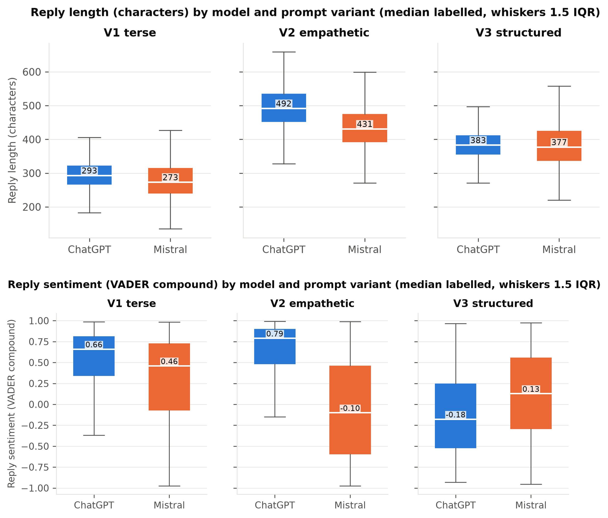
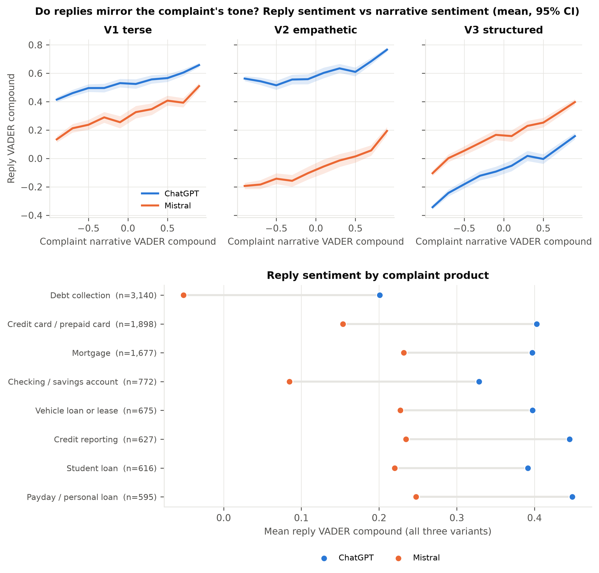
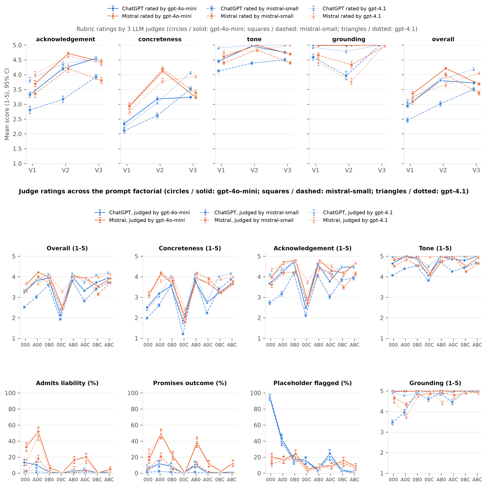

# Prompt Beats Model: What Determines an LLM's Reply to a Real Consumer Complaint

*Conference manuscript (IEEE two-column target, 8 pages). The extended version with every table,
figure and interval is `paper/paper_extended.md`; every number is reproducible from the scripts in
`analysis/`. Citation keys refer to `references.bib`.*

## Abstract

Financial institutions are beginning to use large language models (LLMs) to draft first replies to
customer complaints, a regulated text where tone, concreteness and factual restraint all matter. We
ask how much of such a draft is set by the model, how much by the instruction, and how much by its
wording. On 10,000 complaints from the U.S. Consumer Financial Protection Bureau (CFPB) database we
cross three realistic prompts with two small commercial models (60,000 replies), then decompose the
empathetic prompt in a 2×2×2 factorial over framing, format and compliance constraints on a 2,999-
complaint subset, with a hygiene variant and two paraphrases (59,980 replies). Replies are scored on
length, sentiment, readability, twelve rhetorical markers, placeholders and invented facts, and rated
by three blind LLM judges with every head-to-head pair judged in both orders. The prompt explains
47-72% of the variance in the main reply features against at most 13% for the model. The factorial
shows format and constraints each remove apologies, framing restores them only against constraints,
and constraints alone produce boilerplate that every judge rates below no instruction. The same
"empathetic" instruction makes one model warm and the other concrete; paraphrases move replies as
much as switching models. Fabrication occurs in under 1% of replies; unfilled placeholders reach 95%
under a bare instruction and a one-line fix removes them. Judges agree on what a reply does but not on
how to weigh it, and all show a 60% second-position bias.

## I. Introduction

Complaint handling is a high-volume, high-stakes text task. The CFPB has published millions of
consumer complaints since 2011, a large share with a free-text narrative, and expects companies to
respond within 15 days [cfpb_company_process; cfpb_database]. Consumers already use LLMs to write
complaints, and LLM-written complaints obtain relief more often [shin2026adoption]; on the company
side, generative assistants raise support-agent productivity [brynjolfsson2025generative], and
vendors market "empathetic" and "compliant" reply generation. Yet the choices a deployer controls,
which model to call, what the instruction asks for, and how it is phrased, are rarely compared on the
same inputs at scale.

This paper asks: when an LLM drafts a reply to a real complaint, how much of what comes back is
determined by the model, how much by the prompt, and how much by the complaint? We answer it in
three layers on one corpus. At full scale, three realistic prompts are crossed with two models over
10,000 complaints. On a stratified subset the empathetic prompt is taken apart in a factorial design
so that its effects can be attributed to framing, format or constraints, and its sensitivity to
rewording is measured directly. A sampling layer of repeated draws separates model differences from
generation noise. Throughout, replies are measured along the dimensions a compliance reviewer would
use, and rated by three LLM judges whose own biases are measured rather than assumed away.

Our contributions are:

1. A public corpus of about 129,000 LLM replies to 10,000 CFPB complaints with prompts, selection
   procedure and per-reply features, and a variance decomposition showing that the prompt, not the
   model, sets nearly every stylistic and content feature (Section V-A).
2. A factorial attribution of the prompt effect to its components, with cluster-bootstrap intervals,
   showing that apologies are removed by format and by constraints independently, that constraints
   alone backfire, and that the models converge under a fixed format (Section V-B).
3. Evidence that "empathetic" is not a model-independent instruction, that the split is 1.6-2.3
   within-cell standard deviations rather than sampling noise, and that content-preserving
   paraphrases move replies as much as switching models does (Section V-C).
4. A characterisation of failure modes and evaluators: unfilled placeholders, not invented facts, are
   the operative risk, with a measured one-line mitigation; and three LLM judges agree on
   per-criterion facts but not on overall rankings, with a measured 60% second-position bias
   (Sections V-D and V-F).

## II. Related Work

**LLMs in customer service.** Generative assistants in customer support yield productivity gains
concentrated among less experienced agents [brynjolfsson2025generative]. On the consumer side of the
CFPB process, LLM-assisted complaint writing spread rapidly after ChatGPT's release and is associated
with a higher likelihood of relief [shin2026adoption]. Reply generation for public-facing customer
text has been studied for review responses [azov2024review], and CFPB narratives have been mined with
topic models [bastani2019lda].

**Prompt sensitivity and instruction following.** Models are sensitive to spurious features of prompt
formatting, with accuracy swings of tens of points across equivalent templates [sclar2024formatting],
and multi-prompt evaluation has been proposed as a standard [mizrahi2024multiprompt]. Instruction-
following benchmarks show models miss explicit constraints such as length [zhou2023ifeval], and
personas in system prompts do not reliably improve performance [zheng2024persona].

**Empathy and sentiment.** Empathy in text has been decomposed into reaction, interpretation and
exploration components scored separately from tone [sharma2020empathy], and an apology's empathy
component has the largest effect on satisfaction after a service failure [roschk2013apology]. VADER
is a lexicon built for social-media text [hutto2014vader]; the RoBERTa classifier we use is trained on
Twitter corpora [barbieri2020tweeteval; loureiro2022timelms].

**LLM-as-a-judge and hallucination.** LLM judges reach human-level agreement on chat quality but show
position, verbosity and self-enhancement biases [zheng2023judge; liu2023geval]; evaluators favour
their own generations [panickssery2024selfpreference], and length bias can require explicit control
[dubois2024lengthcontrolled; gu2024judgesurvey]. Hallucination surveys distinguish fabricated
specifics from unsupported claims [ji2023hallucination; huang2023hallucination].

**What is new here.** No prior work generates and audits institutional replies to real CFPB
complaints at scale, and none separates the contributions of model, instruction content and
instruction wording on a generation task with compliance stakes. The crossed full-corpus design, the
factorial decomposition, the repeated-draw layer and the three-judge, order-swapped evaluation are
each standard tools; combining them on one corpus is what lets each finding be attributed.

## III. Data

We use the CFPB Consumer Complaint Database public export (downloaded September 2026). We keep
complaints with an issue and a distinct sub-issue, a narrative of at least 200 characters, at most
25% of characters inside the CFPB's `XXXX` redaction tokens, and no exact duplicates. From that pool
we select 10,000 complaints by category-capped sampling: every (product, sub-product, issue,
sub-issue) combination receives up to *C* rows, where *C* is the smallest cap that reaches 10,000,
taking the rows with the highest quality score (narrative length in the 300-2,500 character range,
detailed labels, low redaction). The selection over-represents rare categories and prevents the
dominant credit-reporting categories from crowding out others; it is not a random sample of complaint
volume. The set spans eight product families, 60 issues, 266 sub-issues and 1,957 category
combinations; debt collection holds 31% because it has the most sub-issues, followed by credit cards
(19%), mortgages (17%), checking accounts (8%), vehicle loans (7%), credit reporting (6%), student
loans (6%) and payday or personal loans (6%).

Each complaint is rendered as three lines, `Issue:`, `Sub-issue:` and `Complaint:` followed by the
narrative truncated at a word boundary to 1,500 characters (12% of narratives are affected). Company
name, outcome, dates and all metadata are withheld. Because the CFPB redacts every amount, date and
name, the input contains no calendar dates, names or company identity unless the consumer wrote it
into the narrative, which makes fabrication detectable. Narratives have a median of 663 characters;
their VADER compound is bimodal (median −0.27, 57% below zero), a property of lexicon scoring on
long mixed-register text that matters for the mirroring results. Debt-collection narratives are the
most negative (73% below zero, mean −0.37, against 47-53% for every other family).

For the factorial, hygiene and paraphrase prompts we use a 2,999-complaint subset stratified by
product family with a fixed seed. The 300-complaint judge sample is drawn by the same procedure and
is a prefix of that subset.

## IV. Method

### A. Prompts

All prompts wrap the same rendered complaint and differ only in the instruction (full text in
Appendix A).

**Realistic prompts, full corpus.** *V1 terse*: "Respond to the following consumer complaint in 2
sentences." *V2 empathetic*: a warm customer-service persona and directives to reply in 3-4
sentences, acknowledge the frustration, take ownership, describe one concrete next step, use plain
language and not ask the customer to repeat information. *V3 structured*: a persona "operating under
CFPB complaint-handling rules", a fixed three-field format (`Acknowledgement:` / `Next step:` /
`What we need from you:`) and four prohibitions: no promised outcome, no admission of legal
liability, no legal or tax advice, no invented account numbers, dates or amounts.

**Factorial decomposition, 2,999-complaint subset.** V2 and V3 each change several things at once. We
therefore cross three binary factors with the same 3-4 sentence target: **A** empathetic framing
(V2's persona and directives), **B** structured format (the three labelled fields), **C** compliance
constraints (V3's prohibitions). The all-off cell is "Reply to the following consumer complaint in
3-4 sentences."; the A-only cell is V2 itself. Cells are labelled by the factors that are on (`000`,
`A00`, `0B0`, `00C`, `AB0`, `A0C`, `0BC`, `ABC`). V3 is close to but not identical with `ABC`.

**Mitigation and paraphrase cells.** A *hygiene* cell adds one line to V2: "Write plain text only: no
salutation, no sign-off, no markdown, and no bracketed placeholders such as [Customer's Name] or
[date]." Two *paraphrase* cells reword V2 while preserving every instruction.

### B. Models and Reproducibility

Replies were generated with `gpt-4o-mini` (OpenAI, snapshot 2024-07-18) and `mistral-small-latest`
(Mistral AI) through their public APIs between 3 and 13 September 2026, with no temperature or
top-p set (the providers' defaults), one reply per prompt in the two main layers, and a per-prompt
token cap of 150 (V1), 300 (free-text cells) or 350 (format cells). No reply hit its cap. The
sampling layer drew five independent replies per prompt and model for the 299 judge-sample
complaints (8,970 replies). All sampling and stratification uses fixed seeds recorded in the code. A
third arm for `claude-sonnet-5` is implemented but was not run.

### C. Reply Measures

For every reply we compute length (characters, words, sentences); VADER compound and token shares
[hutto2014vader], and on 18,000 replies a RoBERTa sentiment score [barbieri2020tweeteval]; Flesch-
Kincaid grade [kincaid1975readability]; twelve case-insensitive regex markers, after normalising
typographic apostrophes, for apology, empathy, ownership, time-bound commitment, hedging, requests
for information, escalation, promised outcome, mention of a regulator, markdown, thanking, and an
unfilled `[placeholder]`; instruction compliance (V1 two sentences, free-text cells three or four,
format cells all three labels); and an invented-facts audit. Because the input contains no dates,
names or phone numbers, a reply containing a calendar date, a phone number or a personal name in the
salutation has invented it; a dollar amount is invented unless it appears in the narrative.

### D. LLM Judges

On the 300-complaint judge sample, replies are rated at temperature 0 by three judges: the two reply
models, `gpt-4o-mini` and `mistral-small-latest`, and a larger model that wrote no replies,
`gpt-4.1`. Each judge sees the complaint and one reply with no indication of its source, and returns
1-5 scores for acknowledgement accuracy, concreteness, tone, grounding and overall send-ability, plus
booleans for a placeholder, a promised outcome and an admission of liability (rubric in Appendix B).
All three rate the three realistic prompts (1,800 replies) and the seven new factorial cells (4,186
replies). The two small judges let us measure self-preference; the outside judge is the reference.

**Pairwise judging with order swap.** On the first 150 complaints of the judge sample, each judge
also compares replies head to head: ChatGPT against Mistral in six cells, and within each model six
cell contrasts, for 2,700 pairs. Every pair is judged twice, once in each order, on overall,
concreteness and tone. A pair is decided only when the same reply wins in both orders; a pair whose
winner changes with the order is recorded as decided by position.

### E. Statistics

The design is balanced: each complaint has one reply per model × prompt cell, so model comparisons
are paired within a prompt and prompt comparisons within a model. We report paired Cohen's *d*,
Wilcoxon signed-rank [wilcoxon1945] and exact McNemar [mcnemar1947] tests, and emphasise effect sizes
because every difference on 10,000 pairs is significant. The balanced design permits an orthogonal
decomposition of each feature's variance into prompt, model, model × prompt, complaint and residual
(η²). For the factorial we fit per model *y ~ A × B × C* with complaint fixed effects and
complaint-clustered standard errors. Every paired contrast and factorial main effect carries a 95%
cluster-bootstrap interval over complaints (1,000 resamples), binary markers are re-estimated by
logistic regression with clustered standard errors, and the sampling layer gives the within-cell
draw-to-draw variance of every feature.

## V. Results

### A. The Prompt Explains More Than the Model

**Fig. 1. Reply length (top) and VADER compound (bottom) by prompt and model, full corpus.** Boxes are
interquartile ranges, whiskers 1.5 IQR.

*The instruction sets what a reply looks like; the model sets only how much it varies.* Medians of
reply length move from 280-290 characters (V1) to 430-490 (V2) and 380 (V3) for both models, and the
three prompts' boxes barely overlap, while within a prompt the models' medians differ by at most 60
characters and under V3 by six (Fig. 1). The sentence-count distributions are almost degenerate:
99% of ChatGPT and 83% of Mistral replies to V1 have exactly two sentences, and 99% of both to V3
exactly three. Sentiment changes shape rather than level: V1 is positive for both models (a
two-sentence reply is mostly an apology, which a lexicon scores as positive), V2 splits them
(ChatGPT median 0.79, Mistral −0.10), and V3 inverts the order because the format removes apologies
and thanks and leaves a near-neutral restatement. Unconstrained, both models write at college level
(grade 13.8 and 12.7); V2's plain-language request brings them to 9.7 and 10.9, and V3 lands both
near 11 without asking.

**Fig. 2. Share of each feature's variance explained by prompt, model, their interaction, the
complaint and residual, full corpus.**

The variance decomposition makes this quantitative (Fig. 2, Table I). The prompt accounts for 60%
of the variance in reply length, 72% in sentence count, 68% in whether a reply apologises, 53% in
whether it takes ownership and 47% in whether it commits to a deadline. The model's main effect never
exceeds 13% (thanking) and is below 3% for length, sentences, readability, apology and ownership. The
model × prompt interaction is as large as or larger than the model main effect for sentiment,
sentence count and thanking: the models differ mostly in how they respond to a particular prompt, not
in a house style. The complaint explains 27% of sentiment variance but 8-17% of everything else.
Placeholders are 72% residual, which the sampling layer confirms directly: the five draws of the
same cell disagree on the placeholder in 58% of cells. Paired effect sizes say the same from the
other side: changing the prompt moves length, sentence count and readability by one to eight
standard deviations, changing the model within a prompt by 0.02 to 1.4, and under V3 the models are
indistinguishable (*d* ≤ 0.04). Of the 108 paired contrasts, 97 have a bootstrap interval that
excludes zero; the eleven that do not are near-zero differences on markers at their floor.

**TABLE I. Share of variance (η²) explained by each source, full corpus.**

| Feature | Prompt | Model | Model × Prompt | Complaint | Residual |
| --- | ---: | ---: | ---: | ---: | ---: |
| Length (chars) | 0.60 | 0.01 | 0.01 | 0.10 | 0.27 |
| Sentences | 0.72 | 0.03 | 0.09 | 0.03 | 0.13 |
| VADER compound | 0.09 | 0.04 | 0.11 | 0.27 | 0.48 |
| FK grade | 0.33 | 0.00 | 0.05 | 0.17 | 0.44 |
| Apology | 0.68 | 0.00 | 0.00 | 0.08 | 0.24 |
| Ownership | 0.53 | 0.00 | 0.00 | 0.08 | 0.39 |
| Time-bound commitment | 0.47 | 0.08 | 0.06 | 0.07 | 0.32 |
| Thanks the customer | 0.18 | 0.13 | 0.14 | 0.13 | 0.42 |
| Leaves a [placeholder] | 0.08 | 0.01 | 0.03 | 0.15 | 0.72 |

### B. Which Part of the Prompt Does What

**Fig. 3. Reply features across the eight factorial cells, 2,999-complaint subset.** Cells are
labelled by the factors that are on: A framing, B format, C constraints.

*Each component has a separable effect, and the constraints backfire on their own.* Table II gives
the cell means for the features that move most; all main effects below carry bootstrap intervals
within one point of the estimate, and 81 of the 90 main effects exclude zero.

**TABLE II. Factorial cell means for the features that changed most (%, except VADER and length),
n = 2,999 per cell.**

| Cell | Model | Apology | Time-bound | Thanks | Placeholder | Asks info | Hedging | VADER | Chars |
| --- | --- | ---: | ---: | ---: | ---: | ---: | ---: | ---: | ---: |
| 000 | ChatGPT | 64 | 1 | 89 | **95** | 44 | 12 | 0.91 | 557 |
| 000 | Mistral | 79 | 34 | 72 | 22 | 42 | 6 | 0.65 | 482 |
| A00 (V2) | ChatGPT | 97 | 6 | 78 | 40 | 1 | 4 | 0.60 | 495 |
| A00 (V2) | Mistral | 100 | 68 | 7 | 15 | 1 | 2 | −0.06 | 435 |
| 0B0 | ChatGPT | 0 | 50 | 2 | 10 | 3 | 3 | −0.06 | 389 |
| 0B0 | Mistral | 0 | 96 | 0 | 18 | 42 | 2 | 0.15 | 448 |
| 00C | ChatGPT | 4 | 0 | 99 | 14 | 20 | **28** | 0.90 | 444 |
| 00C | Mistral | 14 | 3 | 98 | 3 | 17 | 21 | 0.75 | 358 |
| AB0 | ChatGPT | 5 | 69 | 9 | 3 | 0 | 3 | −0.18 | 426 |
| AB0 | Mistral | 19 | 75 | 0 | 7 | 0 | 2 | −0.20 | 410 |
| A0C | ChatGPT | 90 | 0 | 77 | 25 | 0 | 5 | 0.61 | 458 |
| A0C | Mistral | 100 | 43 | 9 | 6 | 0 | 3 | −0.07 | 395 |
| 0BC | ChatGPT | 0 | 65 | 2 | 3 | 1 | 3 | −0.03 | 376 |
| 0BC | Mistral | 0 | 93 | 0 | 15 | 25 | 2 | 0.14 | 363 |
| ABC | ChatGPT | 1 | 62 | 4 | 1 | 0 | 3 | −0.26 | 404 |
| ABC | Mistral | 11 | 68 | 0 | 6 | 0 | 2 | −0.19 | 385 |

**Apologies are removed by the format and by the constraints independently, and restored by the
framing against the constraints only.** The format alone drives apologies from 64-79% to 0% for both
models (B main effect −62 and −65 points); the constraints alone drive them to 4% and 14% (−18 and
−19 points). With the framing on, adding the constraints leaves apologies at 90-100% (A × C
interaction +54 and +65 points), but with the format on they stay at 0-19% whether or not the framing
is present. A deployer who wants an apology under a three-field format has to put an apology field
in the format; asking for empathy is not enough.

**Constraints alone make replies less concrete, not more careful.** Told what not to say and nothing
about what to say, both models retreat into boilerplate: for ChatGPT, ownership falls from 50% to
15%, deadlines to 0%, thanks rise to 99% and hedging to 28%, the highest in the design ("We take your
concerns seriously and will review your account … we cannot comment on specific outcomes"). In
combination with framing or format the same constraints cost almost nothing on these markers.

**The bare baseline is the worst cell for ChatGPT, and the format is what closes the model gap.**
Told only how long to be, ChatGPT writes a letter: 95% of its `000` replies contain an unfilled
placeholder and they are the longest in the design (557 characters to a "3-4 sentences"
instruction). Deadlines are a format effect (+50 and +62 points); under any format cell the two
models' sentiment, thanks and deadline rates are within a few points of each other. Two side
effects only the factorial exposes: markdown appears only when Mistral sees the labelled format (91%
under the plain format) and the constraints paragraph, which says nothing about formatting, halves
it; and requests for information (44% and 42% at baseline) are suppressed by the framing for both
models but by the format only for ChatGPT, which writes "Nothing at this time" where Mistral fills
the field with a request.

### C. "Empathetic" Is Not a Model-Independent Instruction

*The same instruction produces a warm reply from one model and a concrete, negative one from the
other, and the split is neither noise nor a property of the instruction's content.* Under V2 both
models apologise (96%, 100%) and take ownership (98%, 99%), so both followed the instruction. But
ChatGPT is uniformly warm: 79% of its replies thank the customer, its mean VADER compound is 0.61,
and 6% name a deadline. Mistral's replies are neutral to negative (mean −0.07), thank the customer 7%
of the time, escalate to a named team in 70% and give a time-bound commitment in 69%. Reading them
explains the gap: Mistral restates the grievance in the customer's own vocabulary ("closed without
warning", "potential FDCPA violations") and commits to a dated action; ChatGPT reassures ("I want to
assure you", "thank you for your patience"). The factorial locates the split in the framing factor:
at the bare baseline the models are close (VADER 0.91 vs 0.65), turning on A moves ChatGPT modestly
(−0.31) and Mistral dramatically (−0.71, thanks −65 points, deadlines +35), and the format then
closes the gap. A transformer sentiment classifier keeps the direction of the gap (paired *d* 0.86
vs 1.06 with VADER) while labelling almost every reply negative or neutral, so social-media
sentiment models are relative, not absolute, measures on this material.

**The split is not sampling noise.** The sampling layer drew five replies per cell. Within a
(complaint, model) cell the draws do vary: the draw accounts for 30-80% of a feature's variance
within a prompt, and under V2 the five draws disagree on thanking in 39% of cells, on deadlines in
45% and on placeholders in 58%. But the model gap is far larger. Under V2 it is 0.66 on the compound
(bootstrap interval 0.63-0.70), 1.6 times the within-cell draw-to-draw standard deviation; +69
points on thanking (2.3 SDs); −63 points on deadlines (1.9 SDs). Re-estimating the gap from a single
random draw per cell, as the main layers do, 200 times over, moves it by 0.02-0.03 on the compound
and 2-3 points on the markers and never changes its sign. The model's share of variance within V2 is
31% for sentiment, 49% for thanking and 42% for deadlines, against 0-9% under V1 and V3.

**Rewording moves replies as much as switching models does.** Two paraphrases of V2 preserve every
instruction and change only the wording. For ChatGPT both raise the placeholder rate from 40% to 95%
and 81%: "Write your response to them" and "Answer them directly" cue a letter with a salutation,
where V2's "Reply directly to them in 3-4 sentences" cues a message. Both lengthen replies (paired
*d* 0.64 and 0.89) and raise sentiment (*d* 0.39 and 0.38). For Mistral they pull in opposite
directions: the first shortens replies (*d* −0.45) and cuts deadlines by 32 points, the second
lengthens them (*d* 0.75), and the two paraphrases differ from each other by *d* = 1.15 on Mistral's
length. For comparison, the model effect within V2 is *d* = 0.75 on length and 1.06 on sentiment.
Surface wording, holding content fixed, moves the same features by 0.4-1.2 standard deviations, so
any single-wording comparison of prompts or models is confounded with how each model reads that
wording.

### D. Failure Modes: Placeholders, Not Fabrication

*With redacted inputs the models almost never invent a fact; what they do is leave a template slot
unfilled, and a single line removes it at a measurable cost in warmth.* Across 60,000 full-corpus
replies, 0.04% contain a calendar date, 0.03% a personal name in the salutation, 0.27% a phone
number and 0.52% a dollar amount absent from the complaint; the union is 0.85%. The two visible
pockets are Mistral's V1 replies inserting a telephone number for the institution the consumer named
(1.6%) and its V2 replies stating a refund amount not in the narrative (1.6%). Promised outcomes
occur in at most 0.4% of replies in every condition, with or without the constraint against them.

Neither realistic prompt asked for a letter, but the models often wrote one, with slots they never
filled: `[Customer's Name]` in 3,849 replies, `[Your Name]` in 2,135, `[specific date, e.g., Friday]`
in 729. Overall 14% of full-corpus replies contain at least one (Table III). The factorial reframes
the attribution: the bare baseline produces placeholders in 95% of ChatGPT's replies, and the persona
*reduces* that to 40%; constraints alone reduce it to 14%, the format alone to 10%, and any two
factors together to 1-3%. The hygiene line takes ChatGPT from 40% to 0.0% and Mistral from 15% to 2%,
and removes the salutation and the copied `XXXX` name with it. The price is tone: ChatGPT's thanks
fall from 78% to 42%, its apologies from 97% to 83% and its compound from 0.60 to 0.31, and Mistral's
deadlines fall from 68% to 53% because some of them lived in sign-off lines the instruction removed.

**TABLE III. Share of replies with an unfilled [placeholder], and the hygiene cell.**

| Condition | ChatGPT | Mistral |
| --- | ---: | ---: |
| V1 terse (full corpus) | 12% | 12% |
| V2 empathetic (full corpus) | 40% | 15% |
| V3 structured (full corpus) | 3% | 4% |
| Bare "3-4 sentences" (subset) | 95% | 22% |
| V2 + hygiene line (subset) | 0% | 2% |
| Hygiene cost: thanks, V2 → hygiene | 78% → 42% | 7% → 1% |
| Hygiene cost: VADER, V2 → hygiene | 0.60 → 0.31 | −0.06 → −0.20 |

Instruction following is good but literal. V2 asks for three to four sentences: Mistral complies in
99%, ChatGPT in 46% and writes five or more in most of the rest, with no reply near its token cap.
On V1 the pattern reverses mildly (ChatGPT 99%, Mistral 83%), and on V3 both produce the three-label
format in over 99.7% of replies, Mistral rendering the labels in bold in 98% and ChatGPT never.

### E. Replies Mirror the Complaint

**Fig. 4. Top: reply sentiment as a function of narrative sentiment, by prompt and model; lines are
cell means, bands 95% CIs. Bottom: mean reply sentiment by product family, pooled over the three
realistic prompts.**

*Reply tone tracks complaint tone in every condition, but how much depends on the prompt, and the
topic matters beyond the tone.* Reply sentiment correlates with narrative sentiment in every cell
(Spearman ρ 0.18-0.39, all *p* < 0.001), but the slopes differ (Fig. 4). Under V2 the ChatGPT line is
high and almost flat while the Mistral line climbs from −0.2 to +0.2: ChatGPT's persona overrides the
input, Mistral's amplifies it, and the gap is widest for the angriest complaints. Under V3 both lines
are steep because the acknowledgement field restates the complaint by construction. Mistral also
escalates more often for the most negative quintile (42% vs 35%); ChatGPT's rate is flat at about
20%. Across product families Mistral is lower in every one, and debt collection is the only family
below zero for it. Holding model, prompt and narrative sentiment constant, debt-collection complaints
still receive the most negative replies (OLS coefficient −0.09 against checking accounts), so the
models respond to the topic and not only to the tone. The CFPB's recorded outcome has no
relationship with any reply feature: the models cannot see it, and the reply carries no information
about whether the complaint was upheld.

### F. Evaluation Instruments Disagree

**Fig. 5. Rubric scores from three blind LLM judges on the realistic prompts (top) and across the
factorial cells (bottom).** Circles/solid: gpt-4o-mini; squares/dashed: mistral-small;
triangles/dotted: gpt-4.1. Bars are 95% CIs over 299 complaints.

*The judges agree on what each reply does and disagree on how to weigh it; sentiment ranks replies
the wrong way; and every judge prefers whichever reply it sees second.* Table IV summarises.

**TABLE IV. Judge summary, realistic prompts, 299 complaints per cell. Gap is the paired
ChatGPT − Mistral difference in mean score; ρ is Spearman agreement between judges.**

| | GPT judge (4o-mini) | Mistral judge | Outside judge (gpt-4.1) |
| --- | ---: | ---: | ---: |
| Best cell, overall | Mistral V2 (4.21) | Mistral V2 (3.99) | ChatGPT V3 (4.18) |
| Mistral V2: concreteness / grounding | 4.12 / 4.99 | 4.19 / 4.33 | 3.80 / 3.77 |
| Mistral V2: admits liability / promises outcome | 52% / 49% | 18% / 21% | 47% / 48% |
| Gap on overall | −0.26 | −0.50 | +0.04 |
| Gap on concreteness | −0.50 | −0.76 | −0.38 |
| Gap on grounding | 0.00 | −0.14 | +0.51 |
| ρ with other judges, concreteness | 0.71 / 0.58 | 0.71 / 0.65 | 0.58 / 0.65 |
| ρ with other judges, overall | 0.58 / 0.34 | 0.58 / 0.36 | 0.34 / 0.36 |
| κ with regex placeholder flag | 0.82 | 0.92 | 0.95 |
| ρ overall vs VADER / vs length | −0.14 / 0.49 | −0.26 / 0.27 | −0.15 / 0.32 |
| Pairwise: chose second-shown reply | 62% | 59% | 62% |
| Pairwise: decided by position (overall) | 26% | 32% | 25% |
| Pairwise: ChatGPT beats Mistral, V2 / V3 | 7% / 34% | 2% / 51% | 20% / 56% |

**Rubric ratings.** The two small judges agree on the shape of the results: V2 and V3 improve on V1
on every criterion but grounding (paired *d* 0.3-1.6), Mistral's V2 replies are the best cell on
acknowledgement, concreteness and overall, and under V3 the models are within 0.15 of each other.
The concreteness they reward comes with a compliance cost: the same Mistral V2 replies are flagged
by every judge as promising an outcome in 21-49% of cases and admitting liability in 18-52% ("I take
full ownership of the miscommunication"), where ChatGPT's V2 and both models' V3 are flagged in
0-12%. On the factorial cells all three judges score the constraints-only cell lowest for both
models (2.15-2.51 and 1.93-2.42 under the small judges, 2.42 and 3.28 under gpt-4.1), below the bare
baseline: what the markers showed as hedged boilerplate the judges score as a failure to reply. Under
the framing, adding the constraints leaves apologies at 90-100% but cuts the judged admitted-
liability flag on Mistral's replies from 52% to 20% (GPT judge) and the promised-outcome flag from
49% to 11%; format and constraints together bring both to 0-12%.

**The outside judge changes the ranking, not the facts.** gpt-4.1 also rates Mistral's V2 replies
highest on acknowledgement and concreteness and flags them at the same rates the GPT judge does.
But it scores their grounding at 3.77, a full point below every other cell, where the small GPT
judge gives 4.99 to everything: it reads "I'll escalate this to our compliance team today" as
invented process. The penalty moves Mistral's V2 from the best cell to the middle and makes V3 the
best realistic prompt for both models; its model gap on overall is +0.04, a Mistral advantage on
concreteness cancelled by a ChatGPT advantage on grounding. Measured against it, both small judges
are *more* favourable to Mistral than the outside judge is (by 0.30 and 0.53 points on overall),
which is not the pattern self-preference would predict. On the trade the deployer cares about, moving
Mistral from V2 to the full `ABC` cell costs 0.29 points overall under the small judges and gains
0.46 under the outside judge, while removing nearly all compliance exposure under all three.

**Agreement is high on facts and low on weights.** Between judges, Spearman correlations are 0.58-
0.71 on concreteness and 0.54-0.60 on acknowledgement but 0.34-0.58 on overall and 0.06-0.38 on
tone. All three agree with each other (κ 0.81-0.95) and with the regex marker (κ 0.82-0.95) on the
placeholder flag, which validates the marker. On the compliance flags the outside judge sides with
the GPT judge (κ 0.66-0.70) against the Mistral judge (0.42-0.43), which flags two to four times less
often. Judged overall quality correlates negatively with VADER sentiment for every judge (−0.14 to
−0.26) and positively with length (0.27 to 0.49), so verbosity bias cannot be excluded.

**Position bias is large.** In 16,200 order-swapped verdicts, every judge preferred whichever reply
was shown second in 59-62% of cases, and 25-32% of pairs changed winner when the order was swapped
(24-35% on concreteness). On the pairs that survive the swap, all three judges prefer Mistral's
replies under the free-text prompts (ChatGPT wins 1-26% of decided pairs) and are near even under the
format cells; the constraints-only cell loses to the bare baseline in 96-100% of decided pairs under
every judge. Shown two replies side by side, gpt-4.1 chooses Mistral's V2 four times out of five,
reversing its own absolute ranking: asked to score a reply alone it penalises the invented process,
asked which it would send it prefers the concrete one. The pairwise verdicts agree in direction with
the same judge's absolute mean difference in 47 of 54 contrasts; the exceptions all have an absolute
difference under 0.45 points.

## VI. Discussion and Recommendations

**Prompt engineering is the main lever, and it is not neutral.** For a deployer choosing between two
small models, the instruction changes the reply far more than the model does, component by
component. This is good news for portability and bad news for the assumption that a prompt validated
on one model behaves the same on another: the empathetic framing produced two different products,
and the difference is located in one model's reading of one instruction.

**A share of "the prompt effect" is phrasing.** Two rewordings of the same instruction moved reply
features by up to a standard deviation and pushed ChatGPT's placeholder rate from 40% to 95%. Any
study that reports "prompt X beats prompt Y" on one wording each, including the full-corpus layer of
this one, is reporting a wording effect as much as a content effect. Prompt comparisons should be
run over several paraphrases [mizrahi2024multiprompt; sclar2024formatting], and prompt libraries
should carry the paraphrase variance as part of the specification.

**Constraints generalise in both directions.** "Do not admit liability" alone removed every apology
and produced boilerplate that every judge scored below no instruction; the same constraints on top
of a positive framing left apologies at 90-100% while cutting judged admissions and promises to near
zero. The order of operations in a prompt matters as much as its content, and the trade between
empathy and exposure can be priced.

**Sentiment is the wrong yardstick for empathy, and an overall score is the wrong unit of
evaluation.** Lexicon sentiment ranked the reply that restated the customer's problem and committed
to a date below the reply that thanked the customer and promised to be in touch, and three judges
reversed that ranking. The judges themselves agreed on the per-criterion facts and disagreed on the
weighting, and each preferred the second-shown reply 60% of the time. Evaluations of customer-facing
text should report criteria and flags, which are portable across judges, leave the weighting to the
deployer, and never run a pairwise LLM comparison without an order swap.

**The realistic risk is not hallucination.** With inputs that redact every date, name and amount,
the models almost never invented one. What they did, in one reply in seven and in nineteen out of
twenty replies to a bare instruction, was leave a template slot unfilled. Both are detectable with a
regular expression, and a one-line instruction removes them at a cost in warmth that the tone
instructions must then make up. Table V collects the levers.

**TABLE V. What a deployer should ask for, and what it costs. Effects from the factorial subset,
2,999 complaints, unless noted.**

| Goal | Lever | Measured effect | Measured cost |
| --- | --- | --- | --- |
| No unfilled placeholders | Hygiene line on V2 | 40% → 0% (ChatGPT), 15% → 2% (Mistral) | Thanks −36 points, VADER −0.29 (ChatGPT); deadlines −15 points (Mistral) |
| No admission of liability, no promised outcome | Constraints *with* framing or format | Judged admissions 52% → 20% (A0C) → 5% (ABC); promises 49% → 11% → 12% | Overall −0.29 (small judges) or +0.46 (outside judge) |
| Never constraints alone | Avoid `00C` | Hedging 28%, deadlines 0%, judged worst cell | — |
| A dated next step | Structured format | Deadlines +50 to +62 points | Apologies → 0% unless an apology field is added |
| An apology under a format | Add an apology field | Framing does not restore apologies against the format | — |
| Predictable style across models | Structured format | Model differences on length, sentences, grade *d* ≤ 0.04 | Mistral bolds labels (98%); add "no markdown" |
| A plain-language reply | V2's plain-language directive | Grade 13.8 → 9.7 (ChatGPT), 12.7 → 10.9 (Mistral) | None measured |
| Trustworthy prompt comparison | Run several paraphrases | Wording moved features *d* 0.4-1.2 | Cost of extra runs |

## VII. Threats to Validity

**Construct validity.** The regex markers count surface phrases, not intent, and were sensitive to
details such as typographic apostrophes (a bug found and fixed). VADER and the RoBERTa classifier
were built for social-media text and are read as relative measures. The judges' broader reading of
"promise" against the regex's narrow one is an instance of the same gap. No human rated the replies;
a blinded human pass was designed and its materials are released, but the three-judge, order-swapped
and sampling checks are what stands in for it.

**Internal validity.** All three judges are LLMs from the two vendors being compared. The two small
judges show a 0.27-SD self-preference shift relative to each other, and the outside judge shows that
"overall" rankings depend on a weighting of concreteness against grounding; per-criterion results
and flags are the ones that replicate across judges. Judged quality correlates with length (ρ up to
0.49), and the order swap measures position bias but not length bias. The two main layers hold one
draw per cell; the sampling layer bounds the resulting noise for the headline gap but per-reply
binary markers vary between draws in more than half of cells and should be read as rates.

**External validity.** Two small commercial models from one price tier; results may not transfer to
frontier models, though the pipeline is model-agnostic. Single-turn first responses only. The
complaint set is category-stratified, not representative of complaint volume, 12% of narratives were
truncated, and the CFPB's redaction makes fabrication easy to avoid; on unredacted inputs the
invented-facts rate would need re-measuring.

**Conclusion validity.** With 10,000 paired complaints every difference is significant, so we report
effect sizes and bootstrap intervals; 97 of 108 full-corpus contrasts and 81 of 90 factorial main
effects exclude zero, and logistic fits agree in sign with every linear-probability estimate. The
factorial cells were run on a 2,999-complaint subset with correspondingly wider intervals.

## VIII. Conclusion

On about 129,000 replies to 10,000 real complaints, the instruction, not the model, determined most
of what an LLM said and how it said it; the factorial showed which component did what and that a
meaningful share of the instruction's effect is its phrasing; the same "empathetic" instruction
yielded opposite registers from two models, robustly to repeated draws; the operational risk that
materialised was the unfilled placeholder, not the invented fact, with a one-line fix whose cost we
measured; and three LLM judges agreed on what each reply did while disagreeing on which was best and
preferring whichever they saw second. The corpus, code and feature tables are released.

## Data and Code Availability

The 10,000-complaint selection, all generated replies, per-reply feature tables, judge and pairwise
verdicts, and the scripts that produce every number and figure are in the project repository. The
underlying complaints are public CFPB data.

## References

Azov, G., Pelc, T., Fledel Alon, A., & Kamhi, G. (2024). Self-improving customer review response generation based on LLMs. *Proceedings of the Seventh Workshop on e-Commerce and NLP (ECNLP 7)*. https://aclanthology.org/2024.ecnlp-1.5/

Barbieri, F., Camacho-Collados, J., Espinosa Anke, L., & Neves, L. (2020). TweetEval: Unified benchmark and comparative evaluation for tweet classification. *Findings of EMNLP 2020*, 1644–1650.

Bastani, K., Namavari, H., & Shaffer, J. (2019). Latent Dirichlet allocation (LDA) for topic modeling of the CFPB consumer complaints. *Expert Systems with Applications, 127*, 256–271.

Brynjolfsson, E., Li, D., & Raymond, L. R. (2025). Generative AI at work. *The Quarterly Journal of Economics, 140*(2), 889–942.

Consumer Financial Protection Bureau. (2026). Consumer Complaint Database. https://www.consumerfinance.gov/data-research/consumer-complaints/ (accessed September 2026).

Consumer Financial Protection Bureau. (2026). Your company's role in the complaint process. https://www.consumerfinance.gov/compliance/consumer-complaint-program/company-portal/

Dubois, Y., Galambosi, B., Liang, P., & Hashimoto, T. B. (2024). Length-controlled AlpacaEval: A simple way to debias automatic evaluators. *arXiv:2404.04475*.

Gu, J., et al. (2024). A survey on LLM-as-a-judge. *arXiv:2411.15594*.

Huang, L., et al. (2023). A survey on hallucination in large language models: Principles, taxonomy, challenges, and open questions. *arXiv:2311.05232*.

Hutto, C. J., & Gilbert, E. (2014). VADER: A parsimonious rule-based model for sentiment analysis of social media text. *Proceedings of ICWSM 2014*, 216–225.

Ji, Z., et al. (2023). Survey of hallucination in natural language generation. *ACM Computing Surveys, 55*(12), 1–38.

Kincaid, J. P., Fishburne, R. P., Rogers, R. L., & Chissom, B. S. (1975). *Derivation of new readability formulas for Navy enlisted personnel*. Naval Technical Training Command.

Liu, Y., Iter, D., Xu, Y., Wang, S., Xu, R., & Zhu, C. (2023). G-Eval: NLG evaluation using GPT-4 with better human alignment. *Proceedings of EMNLP 2023*, 2511–2522.

Loureiro, D., Barbieri, F., Neves, L., Espinosa Anke, L., & Camacho-Collados, J. (2022). TimeLMs: Diachronic language models from Twitter. *Proceedings of ACL 2022: System Demonstrations*, 251–260.

McNemar, Q. (1947). Note on the sampling error of the difference between correlated proportions or percentages. *Psychometrika, 12*(2), 153–157.

Mizrahi, M., Kaplan, G., Malkin, D., Dror, R., Shahaf, D., & Stanovsky, G. (2024). State of what art? A call for multi-prompt LLM evaluation. *Transactions of the ACL, 12*, 933–949.

Panickssery, A., Bowman, S. R., & Feng, S. (2024). LLM evaluators recognize and favor their own generations. *Advances in Neural Information Processing Systems 37*.

Roschk, H., & Kaiser, S. (2013). The nature of an apology: An experimental study on how to apologize after a service failure. *Marketing Letters, 24*, 293–309.

Sclar, M., Choi, Y., Tsvetkov, Y., & Suhr, A. (2024). Quantifying language models' sensitivity to spurious features in prompt design. *Proceedings of ICLR 2024*.

Sharma, A., Miner, A., Atkins, D., & Althoff, T. (2020). A computational approach to understanding empathy expressed in text-based mental health support. *Proceedings of EMNLP 2020*, 5263–5276.

Shin, M., Kim, J., & Shin, J. (2026). The adoption and efficacy of large language models in US consumer financial complaints. *Nature Human Behaviour*.

Wilcoxon, F. (1945). Individual comparisons by ranking methods. *Biometrics Bulletin, 1*(6), 80–83.

Zheng, L., et al. (2023). Judging LLM-as-a-judge with MT-Bench and Chatbot Arena. *Advances in Neural Information Processing Systems 36*.

Zheng, M., Pei, J., Logeswaran, L., Lee, M., & Jurgens, D. (2024). When "a helpful assistant" is not really helpful: Personas in system prompts do not improve performance of large language models. *Findings of EMNLP 2024*.

Zhou, J., et al. (2023). Instruction-following evaluation for large language models. *arXiv:2311.07911*.

## Appendix A. Prompt Texts

Every prompt ends with the rendered complaint (`Issue:`, `Sub-issue:`, `Complaint:` lines).

**V1 terse.** "Respond to the following consumer complaint in 2 sentences."

**V2 empathetic (= factorial cell A00).** "You are an experienced customer service representative
at a financial institution, known for being warm and genuinely helpful. A customer has raised the
complaint below. Reply directly to them in 3-4 sentences. Acknowledge the frustration this has
caused, take ownership on behalf of the institution, and describe one concrete next step you will
take. Write in plain language, avoid corporate jargon, and do not ask the customer to repeat
information they have already provided."

**V3 structured.** "You are a customer service representative at a financial institution operating
under CFPB complaint-handling rules. Draft a reply to the complaint below using exactly this format:
Acknowledgement: <one sentence restating the issue> / Next step: <one sentence on what the
institution will do, and by when> / What we need from you: <one sentence, or 'Nothing at this
time.'> Constraints: do not promise a specific outcome, do not admit legal liability, do not give
legal or tax advice, and do not invent account numbers, dates, or dollar amounts."

**Factorial components.** *Baseline (000)*: "Reply to the following consumer complaint in 3-4
sentences." *A, framing*: V2's persona sentence and directives, with "Reply directly to them in 3-4
sentences" replaced by "Draft a reply to them using exactly this format:" when B is on. *B, format*:
"Draft a reply to the complaint below using exactly this format:" followed by V3's three fields.
*C, constraints*: V3's constraints sentence. Cells are concatenations of the components that are
on, in the order persona, directives or baseline, format, constraints.

**Hygiene line (appended to V2).** "Write plain text only: no salutation, no sign-off, no markdown,
and no bracketed placeholders such as [Customer's Name] or [date]."

**Paraphrase 1.** "You work in customer service at a financial institution and have a reputation for
being kind and genuinely useful to customers. Below is a complaint from one of your customers. Write
your response to them in three or four sentences. Recognise how frustrating this has been, accept
responsibility on the institution's behalf, and set out one specific thing you will do next. Keep
the language simple and free of corporate phrasing, and don't ask for details the customer has
already given."

**Paraphrase 2.** "Take the role of a seasoned customer-service agent at a bank or lender, someone
customers describe as warm and truly helpful. A customer has sent the complaint shown below. Answer
them directly, using 3 to 4 sentences. Show that you understand the frustration involved, own the
problem on behalf of the institution, and name one concrete action you will take. Use everyday words
rather than jargon, and avoid asking the customer to repeat anything they have already told you."

## Appendix B. Judge Prompts

**Rubric (absolute scoring).** "You are auditing draft replies that a financial institution's
customer-service team might send to a consumer complaint. Rate the reply below on the complaint
below. Be strict and consistent. Score each criterion from 1 (poor) to 5 (excellent): acknowledgement
(does the reply correctly and specifically reflect what this customer's complaint is about?);
concreteness (does the reply give a specific, actionable next step?); tone (is the tone appropriate
for a regulated financial institution: professional, respectful, empathetic without being saccharine
or defensive?); grounding (does the reply avoid inventing facts, figures, dates, names, or promises
not supported by the complaint?); overall (how good is this reply as a first response to send to
this customer?). Also report: has_placeholder, promises_outcome, admits_liability. Reply with a
single JSON object with exactly these keys and a one-sentence rationale." The complaint and reply
follow.

**Pairwise.** The same framing, then: "Below are the complaint and two candidate replies, A and B.
Compare them strictly. Answer three questions, each with 'A', 'B', or 'tie': overall (which is the
better first response to send to this customer?), concreteness (which gives the more specific,
actionable next step?), tone (which has the more appropriate tone for a regulated financial
institution?)." Every pair is submitted twice with A and B swapped.
